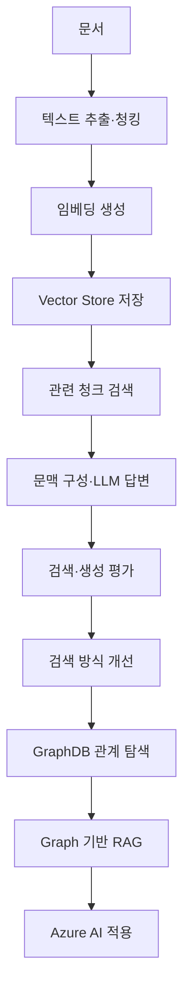

# Spring AI RAG Lab

[🌐 프로젝트 정리 슬라이드](https://seoheejung.github.io/spring-ai-rag-lab/)

## 프로젝트 개요

RAG 처리 과정의 단계별 구현과 검증을 위한 학습 프로젝트

### 주요 방향
* 문서 처리부터 답변 생성까지의 전체 흐름 확인
* 처리 단계별 입력값과 출력값 확인
* Retrieval 실패와 Generation 실패 구분
* 검색 설정 변경에 따른 결과 비교
* 로컬 환경과 Azure AI 구성 비교 (보류)
* 실제 실행 결과 중심의 학습 기록

> 완성된 서비스를 한 번에 구성하는 방식이 아닌 Phase 단위 구현과 검증 방식

---

## 전체 흐름



---

## 진행 단계

| Phase   | 주제                                                  | 주요 범위                                                            |
| ------- |-----------------------------------------------------| ---------------------------------------------------------------- |
| Phase 1 | [문서 읽기와 청킹](docs/phase1-document-chunking.md)       | PDF 읽기, `Document` 확인, 청킹 설정 비교                                  |
| Phase 2 | [임베딩과 벡터 검색](docs/phase2-vector-search.md)          | 임베딩 생성, pgvector 저장, 유사도 검색                                      |
| Phase 3 | [수동 RAG와 QuestionAnswerAdvisor](docs/phase3-rag.md) | 검색 문맥 구성, `ChatClient` 답변 생성, 수동 방식과 Advisor 방식 비교               |
| Phase 4 | [검색·생성 품질 평가](docs/phase4-evaluation.md)            | 평가 질문 구성, 검색 지표 계산, 생성 답변 근거성 평가                                 |
| Phase 5 | [검색 방식 개선](docs/phase5-search-improvement.md)       | 키워드·벡터 검색 비교, RRF 기반 하이브리드 검색, 리랭킹 전후 평가                         |
| Phase 6 | [GraphDB와 Graph 기반 RAG](docs/phase6-graph-rag.md)   | Neo4j 관계 탐색, 관련 문서 ID 조회, Vector Store 원문 연결, 일반 RAG 비교          |
| Phase 7 | Azure AI 적용 (보류)                                    | Azure OpenAI, Azure AI Search, Semantic Ranker, Azure GraphDB 비교 |

---

## 기술 스택

| 구분            | 기술                                 |
| ------------- | ---------------------------------- |
| 언어            | Java 21                            |
| 애플리케이션        | Spring Boot 4.1.0                  |
| AI 프레임워크      | Spring AI 2.0.0                    |
| 로컬 AI 실행 환경   | Ollama                             |
| 임베딩 모델        | `qwen3-embedding:0.6b`             |
| Chat Model    | `qwen2.5-coder:7b`                 |
| Vector Store  | PostgreSQL 17, pgvector            |
| 키워드 검색        | PostgreSQL Full-text Search        |
| 검색 결과 결합      | 애플리케이션 RRF 순위 병합                 |
| 평가 데이터        | JSON                               |
| 검색 품질 평가      | Hit@K, Recall@K, Precision@K, MRR  |
| 생성 품질 평가      | 검색 청크와 생성 답변 수동 대조                 |
| GraphDB       | Neo4j                              |
| 문서 형식         | Markdown, Text, PDF                |
| 빌드 도구         | Gradle                             |

---

## 프로젝트 구조

```text
spring-ai-rag-lab/
├── README.md
├── build.gradle
├── settings.gradle
├── compose.yaml
├── .env.example
├── documents/
│   ├── source/
│   └── normalized/
├── evaluation/
│   ├── questions.json
│   ├── graph-questions.json
│   └── results/
├── docs/
│   ├── phase1-document-chunking.md
│   ├── phase2-vector-search.md
│   ├── phase3-rag.md
│   ├── phase4-evaluation.md
│   ├── phase5-search-improvement.md
│   └── phase6-graph-rag.md
│
└── src/
    ├── main/
    │   ├── java/
    │   │   └── com/example/rag/
    │   │       ├── document/
    │   │       ├── retrieval/
    │   │       ├── generation/
    │   │       ├── evaluation/
    │   │       └── graph/
    │   └── resources/
    └── test/
        └── java/
            └── com/example/rag/
                ├── document/
                ├── retrieval/
                ├── generation/
                ├── evaluation/
                └── graph/
```

| 경로                                | 역할                         |
| --------------------------------- | -------------------------- |
| `documents/source`                | 원본 문서                      |
| `documents/normalized`            | 정규화된 문서                    |
| `evaluation/questions.json`       | 평가 질문, 질문 유형, 기대 문서, 기대 청크 |
| `evaluation/graph-questions.json` | Graph 관계 질문과 탐색 조건         |
| `evaluation/results`              | 검색 결과, 생성 답변, 수동 평가 결과     |
| `docs/phase*.md`                  | Phase별 구현·실행·검증 기록         |
| `src/main/java`                   | 애플리케이션 코드                  |
| `src/main/resources`              | 애플리케이션 설정                  |
| `src/test/java`                   | 자동 검증 코드                   |

> Java 패키지는 Phase 번호가 아닌 기능과 구성요소의 책임을 기준으로 구성

---

## 테스트

```powershell
.\gradlew.bat clean test
```

### 정상 기준

```text
BUILD SUCCESSFUL
```

---

## Phase 1 실행

```powershell
.\gradlew.bat bootRun --args="--rag.document.enabled=true"
```

### 주요 출력

* 페이지별 `Document`
* 문서 ID와 메타데이터
* 본문 시작·종료 부분
* 설정별 청크 수
* 최소·최대·평균 문자 수
* 청크 시작·종료 부분

> 미측정 결과와 임의 수치의 사전 기록 금지

## Phase 2 실행

### Ollama 임베딩 모델 준비

```powershell
ollama pull qwen3-embedding:0.6b
ollama list
```

### 환경 변수 파일 생성

```powershell
Copy-Item .env.example .env
```

```dotenv
PGVECTOR_IMAGE=pgvector/pgvector:0.8.5-pg17-bookworm
POSTGRES_DB=spring_ai_rag
POSTGRES_USER=spring_ai_rag
POSTGRES_PASSWORD=
POSTGRES_PORT=5432
```

> 실제 비밀번호는 `.env`에서 관리하며 Git에 포함하지 않는다.

### PostgreSQL과 pgvector 실행

```powershell
docker compose up -d
docker compose ps
```

### 문서 청크 저장

```powershell
.\gradlew.bat bootRun `
  --args="--rag.retrieval.enabled=true --rag.retrieval.store=true --rag.retrieval.search=false" `
  --console=plain
```

### 유사도 검색

PowerShell에서 공백이 포함된 질문을 안정적으로 전달하기 위해 `SPRING_APPLICATION_JSON`을 사용한다.

```powershell
$env:SPRING_APPLICATION_JSON = '{"rag":{"retrieval":{"enabled":true,"store":false,"search":true,"question":"이 책을 쓴 사람은 누구인가?","top-k":5,"similarity-threshold":0.0}}}'

.\gradlew.bat bootRun --console=plain

Remove-Item Env:SPRING_APPLICATION_JSON
```

### 주요 출력

* `EmbeddingModel` 구현체와 임베딩 차원
* 저장 요청 청크 수
* 검색 결과 수와 순위
* 청크 ID와 메타데이터
* 유사도 점수
* 검색된 청크 본문

### 검증 결과

| 항목                  | 결과                             |
| ------------------- | ------------------------------ |
| 임베딩 구현체             | `OllamaEmbeddingModel`         |
| 임베딩 모델              | `qwen3-embedding:0.6b`         |
| 임베딩 차원              | 1,024                          |
| 생성 청크               | 633개                           |
| 저장 요청 청크            | 633개                           |
| `vector_store` 실제 행 | 633개                           |
| 기본 검색               | Top-K 5에서 정답 청크 미포함            |
| Top-K 비교            | Top-K 10에서 정답 청크 9위            |
| Threshold 비교        | `0.5`, `0.7`, `0.8`에서 검색 결과 0개 |
| 테스트                 | `BUILD SUCCESSFUL`             |
| 답변 생성               | 미포함                            |

> 구현 구조, 검색 결과와 Top-K·Similarity Threshold 비교 내용은 `docs/phase2-vector-search.md`에 기록

## Phase 3 실행

### Ollama Chat Model 준비

```powershell
ollama pull qwen2.5-coder:7b
ollama list
ollama show qwen2.5-coder:7b
```

#### 확인한 Chat Model capability

```text
completion
tools
insert
```

### 환경 변수 설정

#### `.env`에 Chat Model 지정

```dotenv
OLLAMA_CHAT_MODEL=qwen2.5-coder:7b
```

### 한글 출력 설정

```powershell
chcp 65001 > $null

[Console]::InputEncoding =
    [System.Text.UTF8Encoding]::new()

[Console]::OutputEncoding =
    [System.Text.UTF8Encoding]::new()

$OutputEncoding =
    [Console]::OutputEncoding

$env:JAVA_TOOL_OPTIONS =
    "-Dstdout.encoding=UTF-8 -Dstderr.encoding=UTF-8"
```

### 수동 RAG와 QuestionAnswerAdvisor 실행

수동 RAG와 Advisor 방식은 같은 질문, Top-K, Similarity Threshold 사용

```powershell
$env:SPRING_APPLICATION_JSON = @'
{
  "rag": {
    "generation": {
      "enabled": true,
      "question": "그래프 신경망에서 이웃 정보를 집계할 때 어떤 함수를 사용해야 하는가?",
      "top-k": 5,
      "similarity-threshold": 0.7
    }
  }
}
'@

.\gradlew.bat bootRun --console=plain |
  Tee-Object -FilePath .\build\phase3-rag-output.txt

Remove-Item Env:SPRING_APPLICATION_JSON
Remove-Item Env:JAVA_TOOL_OPTIONS
```

### 고정 검색 조건

```text
Top-K: 5
Similarity Threshold: 0.7
Vector Store: PgVectorStore
EmbeddingModel: OllamaEmbeddingModel
Chat Model: qwen2.5-coder:7b
저장 청크: 633개
```

> 검색 결과가 없더라도 Top-K나 Similarity Threshold를 변경하지 않는다.

### 주요 출력

* 공통 질문과 검색 조건
* 검색 결과 수와 순위
* 청크 번호와 유사도
* 검색된 청크 본문
* 수동 RAG Context
* 수동 RAG 답변
* `QuestionAnswerAdvisor` 답변
* Retrieval 실패와 Generation 실패 판정 근거

### 검증 결과

| 항목                   | 결과                            |
| -------------------- | ----------------------------- |
| Chat Model 구현체       | `OllamaChatModel`             |
| Chat Model           | `qwen2.5-coder:7b`            |
| Vector Store         | `PgVectorStore`               |
| 재사용 청크               | 633개                          |
| Top-K                | 5                             |
| Similarity Threshold | 0.7                           |
| 관련 질문 검색 결과          | 0개                            |
| 수동 RAG               | 검색 결과가 없을 때 답변 거부             |
| Advisor              | 검색 문서에서 근거를 확인할 수 없는 답변 생성    |
| Retrieval 실패         | 확인                            |
| Generation 실패        | 확인하지 못함                       |
| 정상 답변 거부             | 확인                            |
| 사전 학습 지식 사용 가능성      | 확인                            |
| Grounding 실패         | 확인                            |
| 전체 테스트               | 9개 성공                         |
| 실패 테스트               | 0개                            |
| 실행 결과                | `BUILD SUCCESSFUL`            |
| 실행 로그                | `build/phase3-rag-output.txt` |

### 방식별 결과

| 항목         | 수동 RAG               | QuestionAnswerAdvisor         |
| ---------- | -------------------- | ----------------------------- |
| 검색 호출      | 직접 호출                | Advisor 내부 처리                 |
| Context 구성 | 직접 생성                | 자동 결합                         |
| 검색 결과 확인   | 직접 가능                | 직접 반환되지 않음                    |
| 생성 답변      | `알 수 없다.`            | 일반 지식 형태 답변                   |
| 답변 거부      | 성공                   | 실패                            |
| 문서 근거      | 관련 문서 없음 상태와 일치      | 수동 검색 결과에서 확인 불가              |
| 실패 유형      | Retrieval 실패 후 정상 거부 | 사전 학습 지식 사용 가능성, Grounding 실패 |

> 구현 구조, 수동 RAG와 Advisor 비교, 실패 원인과 실행 결과는 `docs/phase3-rag.md`에 기록

## Phase 4 실행

> Phase 3 고정 조건 기반 검색·생성 품질 평가 및 Phase 5 비교 기준값 확보

### 고정 조건

| 항목 | 값 |
| --- | --- |
| 원본 문서 | `graph-engineering-v2026.08.02.pdf` |
| 저장 청크 | 633개 |
| Vector Store | `PgVectorStore` |
| 임베딩 모델 | `qwen3-embedding:0.6b` |
| Chat Model | `qwen2.5-coder:7b` |
| 생성 방식 | 수동 RAG |
| Top-K | 5 |
| Similarity Threshold | 0.7 |

#### 제외 범위

* 문서 재처리
* 청킹 변경
* 모델 변경
* 검색 조건 변경
* 검색 방식 개선

### 평가 데이터

```text
evaluation/questions.json
```

| 질문 ID | 유형 | 답변 가능 여부 | 기대 청크 |
| --- | --- | --- | --- |
| `q-001` | `exact-term` | 가능 | `graph-engineering-v2026.08.02.pdf#461` |
| `q-002` | `semantic-paraphrase` | 가능 | `graph-engineering-v2026.08.02.pdf#461` |
| `q-003` | `unanswerable` | 불가능 | 없음 |

- 기대 문서·청크 사전 지정
- 답이 없는 질문의 기대 문서·청크 빈 배열 유지
- 검색 실행 후 평가 데이터 변경 금지

### 평가 실행

```
$env:SPRING_APPLICATION_JSON = @'
{
  "rag": {
    "document": {
      "enabled": false
    },
    "retrieval": {
      "enabled": false
    },
    "generation": {
      "enabled": false
    },
    "evaluation": {
      "enabled": true,
      "questions-path": "evaluation/questions.json",
      "results-path": "evaluation/results/phase4-results.json",
      "top-k": 5,
      "similarity-threshold": 0.7
    }
  }
}
'@

.\gradlew.bat bootRun --console=plain |
  Tee-Object -FilePath .\build\phase4-evaluation-output.txt

Remove-Item Env:SPRING_APPLICATION_JSON
```

### 검색 평가 결과

| 지표 | 결과 |
| --- | --- |
| Hit@5 | `0.0000` |
| Recall@5 | `0.0000` |
| Precision@5 | `0.0000` |
| MRR | `0.0000` |

- `q-001`, `q-002`: 기대 청크 미검색
- `q-003`: 검색 지표 계산 제외
- 검색 결과: 세 질문 모두 빈 배열

### 생성 평가 결과

| 항목 | 결과 |
| --- | --- |
| Retrieval 실패 | `q-001`, `q-002` |
| Generation 실패 | 없음 |
| 정상 거부 | `q-003` |
| 거부 실패 | 없음 |
| Groundedness 실패 | 0건 |
| Unsupported Claim | 0건 |

| 질문 ID | 실패 유형 |
| --- | --- |
| `q-001` | `RETRIEVAL_FAILURE` |
| `q-002` | `RETRIEVAL_FAILURE` |
| `q-003` | `NORMAL_REFUSAL` |

### 테스트 결과

```
.\gradlew.bat clean test --console=plain
```

| 항목 | 결과 |
| --- | --- |
| 전체 테스트 | 12개 |
| 성공 | 12개 |
| 실패 | 0개 |
| 건너뜀 | 0개 |
| 테스트 실행 시간 | 25.541초 |
| Gradle 전체 실행 시간 | 35초 |
| 실행 결과 | `BUILD SUCCESSFUL` |

### 결과 파일

| 파일 | 역할 |
| --- | --- |
| `evaluation/results/phase4-results.json` | 자동 평가 원본 |
| `evaluation/results/phase4-results-reviewed.json` | 생성 품질 수동 판정 결과 |
| `build/phase4-evaluation-output.txt` | 평가 실행 로그 |

> 구현 구조, 검색 지표 계산, 수동 판정 기준, 실패 유형과 상세 실행 결과는 `docs/phase4-evaluation.md`에 기록

## Phase 5 실행

> Phase 4 Retrieval 실패 질문을 대상으로 키워드 검색, 벡터 검색, RRF 하이브리드 검색의 품질과 검색 시간 비교

### 고정 조건

| 항목                   | 값                                   |
| -------------------- | ----------------------------------- |
| 원본 문서                | `graph-engineering-v2026.08.02.pdf` |
| 저장 청크                | 633개                                |
| 평가 질문                | `evaluation/questions.json`         |
| 임베딩 모델               | `qwen3-embedding:0.6b`              |
| 임베딩 차원               | 1,024                               |
| 벡터 검색 Top-K          | 5                                   |
| 키워드 검색 Top-K         | 5                                   |
| Similarity Threshold | 0.7                                 |
| RRF 기준값              | 60                                  |
| 리랭킹 후보 제한            | 20                                  |
| 최종 결과 수              | 5                                   |

#### 제외 범위

* 문서 재처리
* 저장 청크 변경
* 청킹 변경
* 임베딩 모델 변경
* 프롬프트 변경
* Chat Model 변경
* 생성 답변 평가
* GraphDB
* Azure AI

### 검색 방식

| 실험 | 검색 방식                       | 실행 결과         |
| -- | --------------------------- | ------------- |
| A  | PostgreSQL Full-text Search | 질문 3개 모두 0건   |
| B  | pgvector 벡터 검색              | 질문 3개 모두 0건   |
| C  | 키워드 검색 + 벡터 검색 + RRF        | 질문 3개 모두 0건   |
| D  | 하이브리드 검색 + 리랭킹              | 입력 후보가 없어 미수행 |

### 검색 개선 실행

RRF 기준값 설정:

```powershell
$env:RAG_IMPROVEMENT_RRF_K = "60"
```

Phase 5 실행:

```powershell
.\gradlew.bat bootRun `
  --args="--rag.improvement.enabled=true" `
  --console=plain
```

전체 테스트:

```powershell
.\gradlew.bat clean test --console=plain
```

실행 결과:

```text
평가 질문 수: 3
키워드 검색 결과: 모두 0건
벡터 검색 결과: 모두 0건
하이브리드 검색 결과: 모두 0건
리랭킹 후보 수: 모두 0건
전체 테스트: 12개
실패 테스트: 0개
BUILD SUCCESSFUL
```

### 검색 지표 비교

검색 품질 지표는 답변 가능한 `q-001`, `q-002`를 대상으로 계산했다.

| 지표          | Phase 4 벡터 검색 | Phase 5 벡터 검색 |      하이브리드 검색 | 하이브리드 + 리랭킹 |
| ----------- | ------------: | ------------: | ------------: | ----------- |
| Hit@5       |      `0.0000` |      `0.0000` |      `0.0000` | 미수행         |
| Recall@5    |      `0.0000` |      `0.0000` |      `0.0000` | 미수행         |
| Precision@5 |      `0.0000` |      `0.0000` |      `0.0000` | 미수행         |
| MRR         |      `0.0000` |      `0.0000` |      `0.0000` | 미수행         |
| 평균 검색 시간    |       측정하지 않음 |  `90.1305 ms` | `190.3373 ms` | 측정 불가       |

검색 시간은 `q-001`, `q-002`, `q-003`의 실제 검색 호출 시간을 포함해 계산했다.

하이브리드 검색은 벡터 검색보다 평균 `100.2068 ms` 길게 측정됐으며, 검색 품질 지표의 변화는 없었다.

### 확인 결과

* 기대 청크 `graph-engineering-v2026.08.02.pdf#461`의 Vector Store 저장 확인
* 기대 청크 본문과 메타데이터 정상 확인
* 키워드 검색과 벡터 검색의 후보 생성 결과 0건
* RRF 병합 대상과 리랭킹 입력 후보 없음
* RRF `k=60`, `k=20` 비교 결과 순위 변화 없음
* Phase 4 Retrieval 실패 `q-001`, `q-002` 개선 없음
* 리랭킹 상태 `NOT_EXECUTED` 저장
* 기존 테스트 12개 성공
* Phase 5 실행 및 결과 저장 성공

근본 검색 실패 원인은 현재 실행 결과만으로 확정하지 않았다.

### 결과 파일

| 파일                                              | 역할                                                   |
| ----------------------------------------------- | ---------------------------------------------------- |
| `evaluation/results/phase5-search-results.json` | Phase 4 기준값, Phase 5 실행 설정, 검색 지표, 질문별 검색 시간, 리랭킹 상태 |
| `docs/phase5-search-improvement.md`             | 키워드 검색, RRF 하이브리드 검색, 실패 확인, 실행 결과 상세 기록             |

> 키워드 검색 구현, RRF 순위 결합, 리랭킹 미수행 사유와 상세 측정 결과는 `docs/phase5-search-improvement.md`에 기록

## Phase 6 실행

> Phase 4 관계 질문을 대상으로 Neo4j 관계 탐색으로 관련 문서 ID를 조회하고, 기존 Vector Store 원문 검색과 연결해 일반 RAG와 Graph 기반 RAG 결과 비교

### 고정 조건

| 항목 | 값 |
| --- | --- |
| 원본 문서 | `graph-engineering-v2026.08.02.pdf` |
| 저장 청크 | 633개 |
| 평가 질문 | `evaluation/questions.json` |
| Graph 질문 | `evaluation/graph-questions.json` |
| Vector Store | `PgVectorStore` |
| 임베딩 모델 | `qwen3-embedding:0.6b` |
| 임베딩 차원 | 1,024 |
| Chat Model | `qwen2.5-coder:7b` |
| 생성 방식 | 기존 수동 RAG |
| Top-K | 5 |
| Similarity Threshold | 0.7 |
| GraphDB | Neo4j `2026.06.0` |

#### 제외 범위

* 원본 문서와 저장 청크 변경
* 청킹 설정 변경
* 임베딩 모델 변경
* Chat Model 변경
* System Prompt 변경
* Phase 5 키워드·하이브리드·RRF·리랭킹 적용
* Neo4j 원문·청크 ID·임베딩 저장
* LLM 엔티티 자동 추출
* 동적 Cypher
* Microsoft GraphRAG 파이프라인
* Neo4j Vector Search
* Azure AI

### 비교 질문

Phase 4 답변 가능 질문 중 관계 질문만 사용

| 질문 ID | 유형 | 기대 청크 |
| --- | --- | --- |
| `q-001` | `exact-term` | `graph-engineering-v2026.08.02.pdf#461` |
| `q-002` | `semantic-paraphrase` | `graph-engineering-v2026.08.02.pdf#461` |

`q-003`은 Graph 질문 메타데이터에 포함하지 않아 Phase 6 비교에서 제외

### GraphDB 구성

실제 생성 데이터:

| 구분 | 결과 |
| --- | --- |
| `Document` Vertex | 1개 |
| `Topic` Vertex | 2개 |
| `HAS_TOPIC` Edge | 2개 |

```text
graph-engineering-v2026.08.02.pdf
→ HAS_TOPIC
→ 지식 노드

graph-engineering-v2026.08.02.pdf
→ HAS_TOPIC
→ 실행 노드
```

저장 역할:

```text
Neo4j
→ Vertex와 Edge
→ 엔티티명
→ Document.documentId

PostgreSQL + pgvector
→ 원문 청크
→ 청크 메타데이터
→ 임베딩
```

GraphDB에는 원문 본문, 청크 ID, 임베딩을 저장하지 않았다.

### Graph 탐색 결과

1-hop:

```text
Document
→ HAS_TOPIC
→ 지식 노드

Document
→ HAS_TOPIC
→ 실행 노드
```

2-hop:

```text
지식 노드
← HAS_TOPIC -
Document
- HAS_TOPIC →
실행 노드
```

| 항목 | 결과 |
| --- | --- |
| 탐색 유형 | `DOCUMENTS_BY_TOPICS` |
| Hop 수 | 2 |
| 관계 경로 | `HAS_TOPIC → HAS_TOPIC` |
| 관련 문서 ID | `graph-engineering-v2026.08.02.pdf` |

Neo4j 직접 Cypher 결과와 애플리케이션 Graph 탐색 결과가 일치했다.

### Vector Store 연결

```text
Neo4j Document.documentId
=
graph-engineering-v2026.08.02.pdf

PostgreSQL metadata.file_name
=
graph-engineering-v2026.08.02.pdf
```

Graph에서 조회한 문서 ID를 `metadata.file_name` 필터로 사용해 기존 Vector Store에서 검색했다.

```text
Graph 관련 문서 ID
→ file_name 필터
→ 기존 PgVectorStore
→ Top-K 5
→ Similarity Threshold 0.7
```

### Graph RAG 실행

```powershell
$env:SPRING_APPLICATION_JSON = @'
{
  "rag": {
    "document": {
      "enabled": false
    },
    "retrieval": {
      "enabled": false
    },
    "generation": {
      "enabled": false
    },
    "evaluation": {
      "enabled": false
    },
    "improvement": {
      "enabled": false
    },
    "graph": {
      "enabled": true,
      "questions-path": "evaluation/questions.json",
      "graph-questions-path": "evaluation/graph-questions.json",
      "results-path": "evaluation/results/phase6-graph-rag-results.json",
      "top-k": 5,
      "similarity-threshold": 0.7
    }
  }
}
'@

.\gradlew.bat bootRun --console=plain 2>&1 |
  Tee-Object `
    -FilePath .\build\phase6-graph-rag-output.txt

Remove-Item Env:SPRING_APPLICATION_JSON
```

전체 테스트:

```powershell
.\gradlew.bat clean test --console=plain
```

### 검색 결과 비교

| 질문 | 일반 RAG | Graph 관련 문서 검색 | 병합 결과 | 상태 |
| --- | ---: | ---: | ---: | --- |
| `q-001` | 0건 | 0건 | 0건 | `GRAPH_DOCUMENT_SEARCH_EMPTY` |
| `q-002` | 0건 | 0건 | 0건 | `GRAPH_DOCUMENT_SEARCH_EMPTY` |

검색 품질:

| 지표 | 일반 RAG | Graph 기반 RAG |
| --- | ---: | ---: |
| Hit@5 | `0.0000` | `0.0000` |
| Recall@5 | `0.0000` | `0.0000` |
| Precision@5 | `0.0000` | `0.0000` |
| MRR@5 | `0.0000` | `0.0000` |

### 확인 결과

* `q-001`, `q-002` 모두 2-hop Graph 경로 조회 성공
* 관련 문서 ID `graph-engineering-v2026.08.02.pdf` 조회 성공
* `Document.documentId`와 `metadata.file_name` 일치 확인
* 기대 청크 `#461`의 Vector Store 저장과 원문 근거 확인
* 일반 RAG와 Graph 관련 문서 범위 검색 모두 0건
* 두 질문 모두 기대 청크 `#461` 미검색
* Graph 적용 전후 Retrieval 지표 변화 없음
* 두 질문 모두 `GRAPH_RETRIEVAL_FAILURE`로 수동 분류
* 기대 청크가 생성 Context에 없어 Generation 실패로 분류하지 않음
* Vector Store가 단일 문서로 구성되어 Graph 문서 필터의 검색 범위 축소 효과 없음
* 전체 테스트 28개 성공, 실패 0개
* 실제 Neo4j·PostgreSQL·Ollama 연동 성공
* Graph RAG 실행 `BUILD SUCCESSFUL`

근본적인 기대 청크 미검색 원인은 현재 실행 결과만으로 확정하지 않았다.

### 결과 파일

| 파일 | 역할 |
| --- | --- |
| `evaluation/results/phase6-graph-rag-results.json` | Graph RAG 자동 실행 결과 |
| `evaluation/results/phase6-graph-rag-results-reviewed.json` | Retrieval·Generation 실패 수동 검토 결과 |
| `build/phase6-graph-rag-output.txt` | Graph RAG 실제 실행 로그 |
| `docs/phase6-graph-rag.md` | GraphDB 구성, 관계 탐색, Vector Store 연결, 비교 결과 상세 기록 |

> Graph 모델 구성, 1-hop·2-hop Traversal, Vector Store 원문 연결, 일반 RAG와 Graph 기반 RAG 비교 및 수동 검증 결과는 `docs/phase6-graph-rag.md`에 기록

## Phase 7 (보류)

> Phase 1~6의 문서와 평가 조건을 유지하고 로컬 구성을 Azure 서비스로 교체해 결과 비교

### 구성 대응

| 로컬                          | Azure                              |
| --------------------------- | ---------------------------------- |
| 로컬 문서                       | Azure Blob Storage                 |
| Ollama Embedding            | Azure OpenAI Embedding             |
| Ollama Chat                 | Azure OpenAI Chat                  |
| pgvector                    | Azure AI Search                    |
| PostgreSQL Full-text Search | Azure AI Search Full-text Search   |
| 수동 RRF                      | Azure AI Search Hybrid Search      |
| 로컬 리랭킹                      | Azure AI Search Semantic Ranker    |
| Neo4j                       | Azure Cosmos DB for Apache Gremlin |

---

