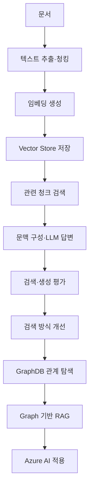

# Spring AI RAG Lab

> Spring AI 기반 문서 처리, 검색, 답변 생성, 품질 평가, 검색 개선, 관계 탐색, Azure AI 적용 실습 프로젝트

## 프로젝트 개요

RAG 처리 과정의 단계별 구현과 검증을 위한 학습 프로젝트

### 주요 방향
* 문서 처리부터 답변 생성까지의 전체 흐름 확인
* 처리 단계별 입력값과 출력값 확인
* Retrieval 실패와 Generation 실패 구분
* 검색 설정 변경에 따른 결과 비교
* 로컬 환경과 Azure AI 구성 비교
* 실제 실행 결과 중심의 학습 기록

> 완성된 서비스를 한 번에 구성하는 방식이 아닌 Phase 단위 구현과 검증 방식

---

## 전체 흐름



---

## 진행 단계

| Phase   | 주제           | 주요 범위                              |
| ------- | ------------ | ---------------------------------- |
| Phase 1 | 문서 읽기와 청킹    | PDF 읽기, `Document` 확인, 청킹 설정 비교    |
| Phase 2 | 임베딩과 벡터 검색   | 임베딩 생성, pgvector 저장, 유사도 검색        |
| Phase 3 | RAG 답변 생성    | 수동 RAG와 `QuestionAnswerAdvisor` 비교 |
| Phase 4 | 검색·생성 품질 평가  | 검색 지표와 답변 근거성 평가                   |
| Phase 5 | 검색 방식 개선     | 키워드·벡터·하이브리드 검색과 리랭킹               |
| Phase 6 | Graph 기반 RAG | GraphDB 관계 탐색과 원문 청크 연결            |
| Phase 7 | Azure AI 적용  | Azure OpenAI와 Azure AI Search 적용   |

---

## 기술 스택

| 구분            | 기술                                 |
| ------------- | ---------------------------------- |
| 언어            | Java 21                            |
| 애플리케이션        | Spring Boot                        |
| AI 프레임워크      | Spring AI                          |
| Vector Store  | PostgreSQL, pgvector               |
| GraphDB       | Neo4j                              |
| 문서 형식         | Markdown, Text, PDF                |
| Azure 모델      | Azure OpenAI                       |
| Azure 검색      | Azure AI Search                    |
| Azure GraphDB | Azure Cosmos DB for Apache Gremlin |
| 빌드 도구         | Gradle                             |

---

## 프로젝트 구조

```text
spring-ai-rag-lab/
├── README.md
├── build.gradle
├── settings.gradle
├── compose.yaml
├── .env.example
├── documents/
│   ├── source/
│   └── normalized/
├── evaluation/
│   ├── questions.json
│   └── results/
├── docs/
│   ├── phase1-document-chunking.md
│   ├── phase2-vector-search.md
│   ├── phase3-rag.md
│   ├── phase4-evaluation.md
│   ├── phase5-search-improvement.md
│   ├── phase6-graph-rag.md
│   └── phase7-azure-rag.md
└── src/
    ├── main/
    └── test/
```

| 경로                          | 역할                  |
| --------------------------- | ------------------- |
| `documents/source`          | 원본 문서               |
| `documents/normalized`      | 정규화된 문서             |
| `evaluation/questions.json` | 평가 질문과 기대 결과        |
| `evaluation/results`        | 검색·답변 평가 결과         |
| `docs/plan.md`              | 전체 학습 기획과 Phase별 범위 |
| `docs/phase*.md`            | Phase별 구현·실행·검증 기록  |
| `src/main`                  | 애플리케이션 코드와 설정       |
| `src/test`                  | 자동 검증 코드            |

> Java 패키지의 기능과 구성요소 책임 기준 구성

---

## 테스트

```powershell
.\gradlew.bat clean test
```

### 정상 기준

```text
BUILD SUCCESSFUL
```

---

## Phase 1 실행

```powershell
.\gradlew.bat bootRun --args="--rag.document.enabled=true"
```

### 주요 출력

* 페이지별 `Document`
* 문서 ID와 메타데이터
* 본문 시작·종료 부분
* 설정별 청크 수
* 최소·최대·평균 문자 수
* 청크 시작·종료 부분

> 미측정 결과와 임의 수치의 사전 기록 금지

---

