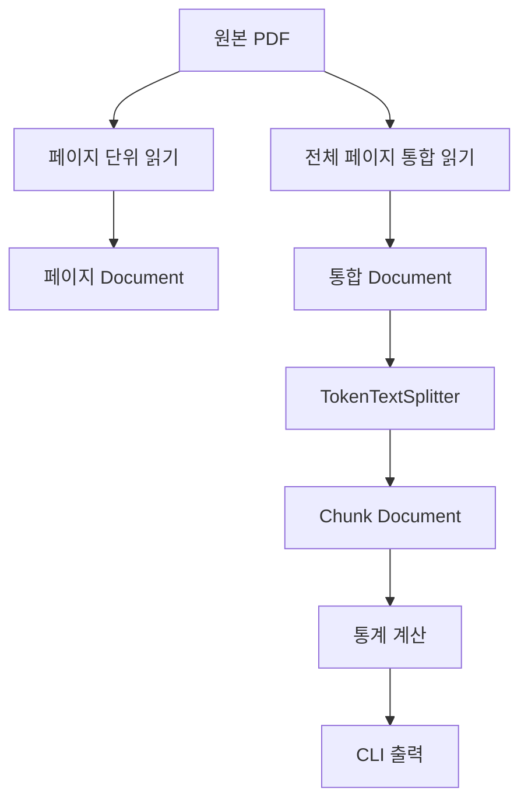

# Phase 1: 문서 읽기와 청킹

> PDF를 Spring AI `Document`로 읽고, `TokenTextSplitter` 설정별 청킹 결과와 메타데이터 유지 특성을 실행값으로 검증한다.

## 1. 범위

| 구분 | 내용 |
| --- | --- |
| 포함 | PDF 읽기, `Document` 확인, 토큰 기반 청킹, Chunk Size 비교, `keepSeparator` 비교, 메타데이터 확인, 자동 테스트 |
| 제외 | 임베딩, Vector Store, PostgreSQL·pgvector, 검색, RAG, 평가, GraphDB, Azure AI |
| 선택 실습 | 사용자 정의 오버랩 미구현 |

---

## 2. 처리 흐름



---

## 3. 개발 환경

| 항목 | 값 |
| --- | --- |
| Java | 21 |
| Spring Boot | 4.1.0 |
| Spring AI | 2.0.0 |
| Gradle | 9.5.1 |
| DSL | Groovy |
| 실행 환경 | Windows PowerShell |
| 애플리케이션 | Non-Web CLI |
| 원본 PDF | `documents/source/graph-engineering-v2026.08.02.pdf` |
| 데이터베이스 | 미사용 |
| AI API Key | 불필요 |

### 원본 파일 확인
```powershell
Test-Path documents/source/graph-engineering-v2026.08.02.pdf
```

---

## 4. 의존성과 설정

### 4.1 핵심 의존성

#### `build.gradle`

| 의존성 | 용도 |
| --- | --- |
| `spring-ai-pdf-document-reader` | PDF 읽기 |
| `spring-ai-bom:2.0.0` | Spring AI 버전 관리 |
| `lombok` | 생성자 주입 |
| `spring-boot-configuration-processor` | 설정 메타데이터 생성 |
| `spring-boot-starter-test` | 테스트 |

### 의존성 확인
```powershell
.\gradlew.bat dependencyInsight `
  --dependency spring-ai-pdf-document-reader `
  --configuration runtimeClasspath
```

#### Windows 한글 출력 설정

```groovy
tasks.named('bootRun') {
    jvmArgs(
            '-Dfile.encoding=UTF-8',
            '-Dstdout.encoding=UTF-8',
            '-Dstderr.encoding=UTF-8'
    )
}
```

### 4.2 애플리케이션 설정

#### `src/main/resources/application.yaml`

```yaml
spring:
  application:
    name: spring-ai-rag-lab
  main:
    web-application-type: none

rag:
  document:
    enabled: false
    source-pdf: documents/source/graph-engineering-v2026.08.02.pdf
```

| 설정 | 역할 |
| --- | --- |
| `web-application-type: none` | 웹 서버 제외 |
| `rag.document.enabled` | CLI 실행 조건 |
| `rag.document.source-pdf` | PDF 경로 |

---

## 5. 구현 구조

```text
src/main/java/com/example/rag/
├── SpringAiRagLabApplication.java
└── document/
    ├── application/
    │   ├── DocumentChunkingService.java
    │   └── model/
    │       ├── ChunkingResult.java
    │       ├── ChunkingScenario.java
    │       └── DocumentProcessingResult.java
    ├── config/
    │   └── DocumentProcessingProperties.java
    ├── infrastructure/
    │   ├── pdf/
    │   │   └── PdfDocumentLoader.java
    │   └── splitter/
    │       └── TokenDocumentSplitter.java
    └── presentation/
        └── cli/
            └── DocumentChunkingRunner.java


src/test/java/com/example/rag/
├── SpringAiRagLabApplicationTests.java
└── document/
    ├── application/
    │   └── DocumentChunkingServiceTest.java
    └── infrastructure/
        ├── pdf/
        │   └── PdfDocumentLoaderTest.java
        └── splitter/
            └── TokenDocumentSplitterTest.java
```

| 구성요소 | 책임 |
| --- | --- |
| `DocumentProcessingProperties` | 실행 여부·PDF 경로 바인딩 |
| `PdfDocumentLoader` | 파일 검증·PDF Reader 실행 |
| `ChunkingScenario` | 실험 조건 정의 |
| `TokenDocumentSplitter` | Splitter 생성·청킹 실행 |
| `ChunkingResult` | 청크 목록·문자 수 통계 |
| `DocumentProcessingResult` | 페이지 문서·실험 결과 묶음 |
| `DocumentChunkingService` | 읽기·청킹 흐름 조정 |
| `DocumentChunkingRunner` | 조건부 CLI 실행·출력 |

#### 구성 기준
- Phase 번호를 Java 패키지에 사용하지 않음
- `application`, `infrastructure`, `presentation` 책임 분리
- PDF Reader와 Splitter 생성 책임을 CLI에서 제외

---

## 6. PDF 읽기

### 6.1 페이지 단위 읽기

#### 메서드

```text
PdfDocumentLoader.loadByPage()
```

#### 핵심 설정

```java
.withPagesPerDocument(1)
.withPageTopMargin(0)
.withPageBottomMargin(0)
```

#### 용도
- 페이지별 본문 확인
- 실제 페이지 번호 확인
- 페이지 `Document` 생성 확인

### 6.2 전체 페이지 통합 읽기

#### 메서드

```text
PdfDocumentLoader.loadAllPages()
```

#### 핵심 설정

```java
.withPagesPerDocument(PdfDocumentReaderConfig.ALL_PAGES)
.withPageTopMargin(0)
.withPageBottomMargin(0)
```

#### 용도

- 전체 PDF를 `Document` 1개로 구성
- 동일 원본으로 청킹 조건 비교

### 6.3 메타데이터

| 읽기 방식 | `file_name` | `page_number` | `end_page_number` |
| --- | --- | --- | --- |
| 페이지 단위 | 생성 | 실제 시작 페이지 | 미생성 |
| 전체 페이지 통합 | 생성 | `1` | `453` |

#### 페이지 단위 결과

```text
file_name=graph-engineering-v2026.08.02.pdf
page_number=3
```

#### 통합 결과

```text
file_name=graph-engineering-v2026.08.02.pdf
page_number=1
end_page_number=453
```

---

## 7. 청킹

### 7.1 비교 조건

| 실험 | Chunk Size | `keepSeparator` | 비교 목적 |
| --- | ---: | --- | --- |
| A | 300 | `true` | 작은 청크 |
| B | 800 | `true` | 비교 기준 |
| C | 1,200 | `true` | 큰 청크 |
| D | 800 | `false` | 구분자 제거 |
| E | 800 | `true` | 구분자 유지 |

### 7.2 고정값

```text
minChunkSizeChars=350
minChunkLengthToEmbed=5
maxNumChunks=5000
```

#### Splitter 설정

```java
TokenTextSplitter.builder()
        .withChunkSize(scenario.chunkSize())
        .withMinChunkSizeChars(MIN_CHUNK_SIZE_CHARS)
        .withMinChunkLengthToEmbed(MIN_CHUNK_LENGTH_TO_EMBED)
        .withMaxNumChunks(MAX_NUM_CHUNKS)
        .withKeepSeparator(scenario.keepSeparator())
        .build();
```

#### 기준
- Chunk Size = 토큰 수
- 문자 수 통계 = String.length()

---

## 8. 실행

### 8.1 테스트

```powershell
.\gradlew.bat clean test --console=plain
```

#### 결과

```text
BUILD SUCCESSFUL in 22s
5 actionable tasks: 5 executed
```

| 항목 | 결과 |
| --- | ---: |
| 성공 테스트 | 5 |
| 실패 테스트 | 0 |

#### 검증 범위

- Spring Context 로딩
- 페이지 단위 PDF 읽기
- 전체 페이지 통합 읽기
- `Document` ID·본문·메타데이터
- 청킹 후 메타데이터 유지
- 5개 청킹 조건 실행

### 8.2 CLI

```powershell
.\gradlew.bat bootRun `
  --args="--rag.document.enabled=true" `
  --console=plain
```

#### 로그 저장

```powershell
.\gradlew.bat bootRun `
  --args="--rag.document.enabled=true" `
  --console=plain |
  Tee-Object -FilePath .\build\phase1-document-chunking-output.txt
```

#### 결과

```text
BUILD SUCCESSFUL in 17s
4 actionable tasks: 1 executed, 3 up-to-date
```

---

## 9. 검증 결과

### 9.1 원본 문서

| 항목 | 결과 |
| --- | --- |
| PDF 처리 페이지 수 | 453 |
| 페이지 `Document` 수 | 416 |
| 통합 `Document` 수 | 1 |
| 첫 페이지 `Document` 번호 | 3 |
| 본문 추출 | 성공 |
| 한글 출력 | UTF-8 설정 후 정상 |
| 제목·문단 | 일반 본문 순서 확인 |
| 표 | 행·열 구조 미유지 |
| 코드 | 내용 추출, 줄바꿈 확인 불가 |
| 머리글·바닥글 | 장 제목·페이지 번호 반복 포함 |

#### 차이

```text
453 - 416 = 37
```

#### 판정

- 37페이지의 `Document` 미생성 원인 미확정
- 생성된 416개 `Document`의 ID와 본문 확인
- 페이지 수와 `Document` 수가 항상 같지는 않음

### 9.2 Chunk Size

| 실험 | Chunk Size | 청크 수 | 최소 문자 수 | 최대 문자 수 | 평균 문자 수 |
| --- | ---: | ---: | ---: | ---: | ---: |
| A | 300 | 1,733 | 606 | 4,891 | 1,703.52 |
| B | 800 | 633 | 2,938 | 11,110 | 4,832.39 |
| C | 1,200 | 420 | 4,665 | 16,562 | 7,337.01 |

#### 확인

- Chunk Size 증가 → 청크 수 감소
- Chunk Size 증가 → 평균 문자 수 증가
- Chunk Size 800은 비교 기준값
- 최적 Chunk Size는 확정하지 않음

### 9.3 `keepSeparator`

| 항목 | D: `false` | E: `true` |
| --- | ---: | ---: |
| Chunk Size | 800 | 800 |
| 청크 수 | 633 | 633 |
| 최소 문자 수 | 2,938 | 2,938 |
| 최대 문자 수 | 11,110 | 11,110 |
| 평균 문자 수 | 4,832.39 | 4,832.39 |
| 미리보기 차이 | 미확인 | 미확인 |
| 줄바꿈 비교 | 불가 | 불가 |

#### 제한 원인

```java
text.replaceAll("\\s+", " ").strip();
```

#### 판정

- D·E 통계 동일
- 콘솔 미리보기 차이 미확인
- Runner 정규화로 줄바꿈 비교 불가
- `keepSeparator`가 항상 효과 없다고 확정하지 않음

### 9.4 Chunk 메타데이터

#### 확인 키

```text
file_name
page_number
end_page_number
chunk_index
parent_document_id
total_chunks
```

#### 실험 E 마지막 청크

```text
chunk_index=632
total_chunks=633
page_number=1
end_page_number=453
file_name=graph-engineering-v2026.08.02.pdf
```

#### 페이지 추적 한계

```text
Chunk 1   → page_number=1, end_page_number=453
Chunk 633 → page_number=1, end_page_number=453
```

- 통합 문서의 페이지 범위가 모든 청크에 복사됨
- 청크별 실제 시작·종료 페이지 판별 불가
- 페이지 출처 보존 방식은 후속 검색 단계에서 검토

---

## 10. 문제와 수정

| 문제 | 원인 | 확인·수정 | 결과 |
| --- | --- | --- | --- |
| IntelliJ import 인식 실패 | IDE 인덱싱 | `dependencyInsight` 확인 후 IDE 재시작 | 정상 인식 |
| PDF Loader 테스트 실패 | 페이지 문서에도 `end_page_number`가 있다고 가정 | `file_name`, `page_number`만 검증 | 5개 테스트 성공 |
| 한글 출력 깨짐 | JVM·콘솔 인코딩 | UTF-8 JVM 옵션 적용 | 정상 출력 |
| `keepSeparator` 차이 확인 제한 | Runner 공백·줄바꿈 정규화 | 제한 사항 기록 | 결과 과대 해석 제외 |

#### 최초 메타데이터 실패

```text
Expecting actual:
  {file_name=graph-engineering-v2026.08.02.pdf, page_number=3}
to contain key:
  end_page_number
```

#### 수정 기준

```java
.containsKeys(
        "file_name",
        "page_number"
)
.doesNotContainKey("end_page_number");
```

---

## 11. 선택 실습

### 사용자 정의 오버랩

| 항목 | 결과 |
| --- | --- |
| `withOverlapSize()` | Spring AI 2.0.0 Builder에 없음 |
| 문맥 분리 사례 | 확정하지 않음 |
| 토큰 단위 오버랩 | 미구현 |
| Phase 1 기본 범위 영향 | 없음 |

#### 미구현 사유

- 동일 원본 위치의 인접 청크 비교 미수행
- 오버랩 필요 사례 미확정
- 문자 중복을 토큰 오버랩으로 기록하지 않음

---

## 12. 완료 기준

- [x] Java 21·Spring Boot 4.1.0·Spring AI 2.0.0 구성
- [x] 원본 PDF 경로 확인
- [x] 페이지 단위 PDF 읽기
- [x] 전체 페이지 통합 읽기
- [x] `Document` ID·본문·메타데이터 확인
- [x] Chunk Size 300·800·1,200 비교
- [x] `keepSeparator=false/true` 비교
- [x] 청크 수·최소·최대·평균 문자 수 측정
- [x] 청킹 후 메타데이터 유지 확인
- [x] 청크 페이지 추적 한계 확인
- [x] 자동 테스트 5개 성공
- [x] CLI 실행 성공
- [x] 한글 출력 확인
- [x] Phase 2 기능 미포함

## Phase 1 결과

| 항목 | 결과 |
| --- | --- |
| PDF 처리 | 453페이지 |
| 페이지 `Document` | 416개 |
| 통합 `Document` | 1개 |
| Chunk Size 300 | 1,733개 |
| Chunk Size 800 | 633개 |
| Chunk Size 1,200 | 420개 |
| 테스트 | 5개 성공 |
| CLI | `BUILD SUCCESSFUL` |
| 확인된 한계 | 37페이지 미생성 원인, 청크별 페이지 추적, `keepSeparator` 줄바꿈 비교 |
