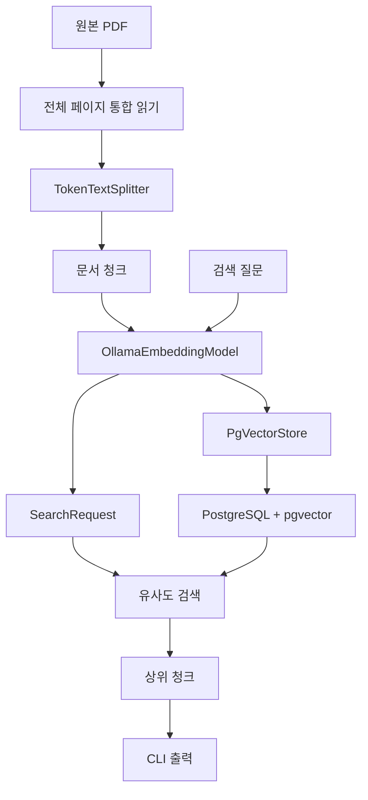

# Phase 2: 임베딩과 벡터 검색

> Phase 1에서 생성한 문서 청크를 임베딩 벡터로 변환해 pgvector에 저장하고, 질문별 유사도 검색 결과와 Top-K·Similarity Threshold의 영향을 실행값으로 검증한다.

## 1. 범위

| 구분    | 내용                                                                                                                                |
| ----- | --------------------------------------------------------------------------------------------------------------------------------- |
| 포함    | `EmbeddingModel`, Ollama 임베딩, PostgreSQL·pgvector, `PgVectorStore`, 청크 저장, 유사도 검색, Top-K 비교, Similarity Threshold 비교, 자동 테스트      |
| 제외    | `ChatModel`, `ChatClient`, 프롬프트, 검색 문맥 구성, LLM 답변 생성, `QuestionAnswerAdvisor`, 검색 품질 지표, 키워드 검색, 하이브리드 검색, 리랭킹, GraphDB, Azure AI |
| 재사용   | Phase 1 PDF Reader, `TokenTextSplitter`, Chunk Size 800·`keepSeparator=true` 조건                                                   |
| 평가 방식 | 검색된 청크 본문과 원본 PDF 직접 대조                                                                                                           |

---

## 2. 처리 흐름



```text
문서 청크
→ EmbeddingModel
→ 문서 벡터
→ PgVectorStore 저장

질문
→ EmbeddingModel
→ 질문 벡터
→ 유사도 검색
→ 상위 청크 반환
```

---

## 3. 개발 환경

| 항목            | 값                                                    |
| ------------- | ---------------------------------------------------- |
| Java          | 21                                                   |
| Spring Boot   | 4.1.0                                                |
| Spring AI     | 2.0.0                                                |
| Gradle        | 9.5.1                                                |
| DSL           | Groovy                                               |
| 실행 환경         | Windows PowerShell                                   |
| 애플리케이션        | Non-Web CLI                                          |
| 원본 PDF        | `documents/source/graph-engineering-v2026.08.02.pdf` |
| Ollama        | 0.20.2                                               |
| 임베딩 모델        | `qwen3-embedding:0.6b`                               |
| 임베딩 차원        | 1,024                                                |
| PostgreSQL    | 17.10                                                |
| pgvector 이미지  | `pgvector/pgvector:0.8.5-pg17-bookworm`              |
| Chat Model    | 미사용                                                  |
| 외부 AI API Key | 불필요                                                  |

### Ollama 확인

```powershell
ollama list
curl http://localhost:11434/api/tags
```

#### 결과

```text
qwen3-embedding:0.6b
```

* 모델 다운로드 성공
* Ollama API 응답 정상
* 모델 목록 등록 확인

---

## 4. 의존성과 설정

### 4.1 핵심 의존성

| 의존성                                       | 용도                           |
| ----------------------------------------- | ---------------------------- |
| `spring-ai-pdf-document-reader`           | Phase 1 PDF 읽기 재사용           |
| `spring-ai-starter-model-ollama`          | `OllamaEmbeddingModel` 자동 구성 |
| `spring-ai-starter-vector-store-pgvector` | `PgVectorStore` 자동 구성        |
| `spring-ai-bom:2.0.0`                     | Spring AI 버전 관리              |
| `spring-boot-starter-test`                | 테스트                          |

### 의존성 확인

```powershell
.\gradlew.bat dependencyInsight `
  --dependency spring-ai-starter-model-ollama `
  --configuration runtimeClasspath
```

```powershell
.\gradlew.bat dependencyInsight `
  --dependency spring-ai-starter-vector-store-pgvector `
  --configuration runtimeClasspath
```

#### 결과

| 항목               | 결과                 |
| ---------------- | ------------------ |
| Ollama Starter   | `2.0.0`            |
| pgvector Starter | `2.0.0`            |
| Spring AI BOM    | `2.0.0`            |
| 의존성 해석 오류        | 없음                 |
| 빌드               | `BUILD SUCCESSFUL` |

### 4.2 pgvector 설정

#### `compose.yaml`

```yaml
services:
  pgvector:
    image: ${PGVECTOR_IMAGE}
    environment:
      POSTGRES_DB: ${POSTGRES_DB}
      POSTGRES_USER: ${POSTGRES_USER}
      POSTGRES_PASSWORD: ${POSTGRES_PASSWORD}
    ports:
      - "${POSTGRES_PORT}:5432"
    volumes:
      - pgvector-data:/var/lib/postgresql/data

volumes:
  pgvector-data:
```

* 실제 인증 정보는 `.env`에서 관리
* `.env`는 Git 제외
* Neo4j 서비스 미포함

### 연결 확인

```powershell
docker compose up -d
docker compose ps
docker compose exec pgvector `
  sh -c 'pg_isready -U "$POSTGRES_USER" -d "$POSTGRES_DB"'
```

#### 결과

```text
/var/run/postgresql:5432 - accepting connections
```

### 4.3 애플리케이션 설정

#### 주요 설정

```yaml
spring:
  main:
    web-application-type: none

  datasource:
    url: jdbc:postgresql://localhost:${POSTGRES_PORT:5432}/${POSTGRES_DB}
    username: ${POSTGRES_USER}
    password: ${POSTGRES_PASSWORD}

  ai:
    model:
      chat: none
      embedding: ollama

    ollama:
      base-url: http://localhost:11434
      init:
        pull-model-strategy: never
      embedding:
        model: qwen3-embedding:0.6b

    vectorstore:
      pgvector:
        initialize-schema: true

rag:
  retrieval:
    enabled: false
    store: false
    search: false
    question: ""
    top-k: 5
    similarity-threshold: 0.0
```

| 설정                                   | 역할                  |
| ------------------------------------ | ------------------- |
| `chat: none`                         | Chat Model 자동 구성 제외 |
| `embedding: ollama`                  | Ollama 임베딩 활성화      |
| `pull-model-strategy: never`         | 실행 중 모델 다운로드 제외     |
| `initialize-schema: true`            | `vector_store` 초기화  |
| `rag.retrieval.store`                | 문서 청크 저장 여부         |
| `rag.retrieval.search`               | 유사도 검색 여부           |
| `rag.retrieval.top-k`                | 최대 검색 결과 수          |
| `rag.retrieval.similarity-threshold` | 최소 유사도              |

---

## 5. 구현 구조

```text
src/main/java/com/example/rag/
├── document/
│   └── application/
│       └── DocumentChunkingService.java
└── retrieval/
    ├── application/
    │   └── VectorSearchService.java
    ├── config/
    │   └── VectorSearchProperties.java
    └── presentation/
        └── cli/
            └── VectorSearchRunner.java

src/test/java/com/example/rag/
└── retrieval/
    └── application/
        └── VectorSearchServiceTest.java
```

| 구성요소                      | 책임                 |
| ------------------------- | ------------------ |
| `DocumentChunkingService` | Phase 1 기준 청크 생성   |
| `VectorSearchProperties`  | 저장·검색 설정 바인딩       |
| `VectorSearchService`     | 청크 저장과 유사도 검색      |
| `VectorSearchRunner`      | CLI 실행과 검색 결과 출력   |
| `OllamaEmbeddingModel`    | 문서·질문 임베딩          |
| `PgVectorStore`           | 본문·메타데이터·벡터 저장과 검색 |

#### 구성 기준

* 기존 `document` 패키지 재사용
* 검색 기능을 `retrieval` 패키지로 분리
* `PgVectorStore` 자동 구성 사용
* 별도 Vector Store 구현 클래스 미생성
* Chat Model 관련 클래스 미생성

---

## 6. 임베딩과 벡터 저장

### 6.1 청킹 조건

Phase 1 실험 B와 같은 조건을 사용했다.

```text
Chunk Size: 800
keepSeparator: true
minChunkSizeChars: 350
minChunkLengthToEmbed: 5
maxNumChunks: 5000
```

### 6.2 저장 흐름

```text
DocumentChunkingService.createChunks()
→ 633개 Document
→ VectorStore.add(chunks)
→ OllamaEmbeddingModel
→ PgVectorStore
→ vector_store
```

### 6.3 검색 흐름

```java
SearchRequest.builder()
        .query(question)
        .topK(topK)
        .similarityThreshold(similarityThreshold)
        .build();
```

검색 결과 출력 항목:

* 순위
* Document ID
* 문서명
* `chunk_index`
* 유사도
* 메타데이터
* 청크 본문

---

## 7. 실행

### 7.1 테스트

```powershell
.\gradlew.bat clean test --console=plain
```

#### 결과

```text
BUILD SUCCESSFUL in 39s
```

#### `VectorSearchServiceTest`

| 항목    | 결과 |
| ----- | -: |
| 테스트 수 |  2 |
| 성공    |  2 |
| 실패    |  0 |
| 건너뜀   |  0 |

#### 검증 범위

* Chunk Size 800 전달
* `keepSeparator=true` 전달
* `VectorStore.add()` 호출
* 저장 요청 청크 수 반환
* 검색 질문 전달
* Top-K 전달
* Similarity Threshold 전달
* 검색 결과 반환

### 7.2 임베딩 모델 확인

```powershell
.\gradlew.bat bootRun `
  --args="--rag.retrieval.enabled=true --rag.retrieval.store=false --rag.retrieval.search=false" `
  --console=plain
```

#### 결과

```text
EmbeddingModel: OllamaEmbeddingModel
Embedding dimensions: 1024
```

### 7.3 문서 저장

```powershell
.\gradlew.bat bootRun `
  --args="--rag.retrieval.enabled=true --rag.retrieval.store=true --rag.retrieval.search=false" `
  --console=plain
```

#### 결과

```text
Processed total 453 pages
Splitting up document into 633 chunks.
저장 요청 청크 수: 633
```

| 항목               | 결과                 |
| ---------------- | ------------------ |
| 생성 청크 수          | 633                |
| 저장 요청 청크 수       | 633                |
| 임베딩 차원           | 1,024              |
| 임베딩 오류           | 없음                 |
| PostgreSQL 저장 오류 | 없음                 |
| 실행 시간            | 1분 19초             |
| 빌드               | `BUILD SUCCESSFUL` |

### 7.4 저장 데이터 확인

```powershell
'SELECT COUNT(*) FROM public.vector_store;' |
docker compose exec -T pgvector `
  sh -c 'psql -U "$POSTGRES_USER" -d "$POSTGRES_DB" -tA'
```

#### 결과

```text
633
```

```text
저장 요청 청크 수 633
=
vector_store 실제 행 수 633
```

| 항목                   | 결과    |
| -------------------- | ----- |
| 청크 본문                | 저장 확인 |
| 메타데이터                | 저장 확인 |
| 임베딩 벡터               | 저장 확인 |
| 벡터 차원                | 1,024 |
| `file_name`          | 저장 확인 |
| `chunk_index`        | 저장 확인 |
| `parent_document_id` | 저장 확인 |
| `total_chunks`       | 633   |

---

## 8. 검색 검증

### 8.1 질문과 정답

```text
질문:
이 책을 쓴 사람은 누구인가?

정답:
리프 메타 (leaf meta)
```

정답 청크는 저자명과 `지은이` 또는 저자임을 확인할 문맥을 함께 포함해야 한다.

### 8.2 기본 검색

```text
Top-K: 5
Similarity Threshold: 0.0
```

| 순위 |  청크 |                   유사도 | 정답 포함 |
| -: | --: | --------------------: | ----- |
|  1 | 593 |  `0.2694792151451111` | X     |
|  2 | 576 |  `0.2554028034210205` | X     |
|  3 |  12 | `0.23842120170593262` | X     |
|  4 | 239 |  `0.2369217872619629` | X     |
|  5 | 590 | `0.23265933990478516` | X     |

#### 판정

* 상위 5개에 정답 청크 없음
* 유사도 내림차순 반환
* 동일 청크 반복 없음
* 본문과 메타데이터 유지
* 책 후반부의 저자 1인칭 서술 청크가 상위에 집중

### 8.3 Top-K 비교

고정 조건:

```text
문서, 저장 청크, 질문, 임베딩 모델,
Similarity Threshold 0.0 동일
```

| 확인 항목    |              Top-K 1 |               Top-K 3 |               Top-K 5 |              Top-K 10 |
| -------- | -------------------: | --------------------: | --------------------: | --------------------: |
| 검색 결과 수  |                    1 |                     3 |                     5 |                    10 |
| 정답 청크 포함 |                    X |                     X |                     X |                     O |
| 정답 청크 순위 |                   없음 |                    없음 |                    없음 |                    9위 |
| 관련 없는 청크 |                   1개 |                    3개 |                    5개 |                    9개 |
| 반복 청크    |                   없음 |                    없음 |                    없음 |                    없음 |
| 최저 유사도   | `0.2694792151451111` | `0.23842120170593262` | `0.23265933990478516` | `0.22479504346847534` |

#### 정답 청크

```text
chunk_index=0
검색 순위=9위
유사도=0.22494250535964966
```

#### 판정

* Top-K `1`, `3`, `5`에서 정답 검색 실패
* Top-K `10`에서 정답 청크 검색
* Top-K 증가 후 기존 상위 결과 순서 유지
* 정답 포함 가능성과 관련 없는 결과 수가 함께 증가

### 8.4 Similarity Threshold 비교

고정 조건:

```text
문서, 저장 청크, 질문, 임베딩 모델,
Top-K 5 동일
```

| 확인 항목    |                   0.0 |   0.5 |   0.7 |   0.8 |
| -------- | --------------------: | ----: | ----: | ----: |
| 검색 결과 수  |                     5 |     0 |     0 |     0 |
| 정답 청크 포함 |                     X |     X |     X |     X |
| 정답 청크 순위 |                    없음 |    없음 |    없음 |    없음 |
| 관련 없는 청크 |                    5개 |    0개 |    0개 |    0개 |
| 제외된 청크   |                    0개 |    5개 |    5개 |    5개 |
| 최저 유사도   | `0.23265933990478516` | 해당 없음 | 해당 없음 | 해당 없음 |

#### 판정

* Threshold `0.0`에서 5개 결과 반환
* Threshold `0.5`부터 결과 0개
* 관련 없는 청크와 검색 가능한 청크가 함께 제외
* 정답 청크가 기본 Top-K 5 결과에 없으므로 임계값에 따른 정답 제외 여부는 판정 불가

### 8.5 메타데이터

검색 결과에서 확인한 키:

```text
file_name
chunk_index
page_number
end_page_number
parent_document_id
total_chunks
distance
```

#### 페이지 추적 한계

```text
page_number=1
end_page_number=453
```

* 통합 Document의 페이지 범위가 모든 청크에 복사
* 청크별 실제 시작·종료 페이지 판별 불가
* Phase 1에서 확인한 한계 유지

---

## 9. 문제와 수정

| 문제                     | 원인                      | 수정                           | 결과           |
| ---------------------- | ----------------------- | ---------------------------- | ------------ |
| IntelliJ import 인식 실패  | IDE 인덱싱                 | Gradle 컴파일 확인                | 컴파일 성공       |
| `Task '책을' not found`  | PowerShell의 공백 포함 인수 처리 | `SPRING_APPLICATION_JSON` 사용 | 검색 성공        |
| SQL 조회값 미출력            | 중첩 따옴표 처리               | SQL을 표준 입력으로 전달              | 행 수 633 확인   |
| 한글 출력 깨짐               | 콘솔 인코딩                  | UTF-8 설정                     | 정상 출력        |
| 청크별 페이지 확인 불가          | 통합 Document 청킹          | 한계 기록                        | 과대 해석 제외     |
| Top-K 5 정답 미검색         | 정답 청크 9위                | Top-K 10 실행                  | 정답 위치 확인     |
| Threshold 0.5 이상 결과 없음 | 최고 유사도 약 0.269          | 실제 결과 기록                     | 높은 임계값 영향 확인 |

### 검색 설정 전달

```powershell
$env:SPRING_APPLICATION_JSON = '{"rag":{"retrieval":{"enabled":true,"store":false,"search":true,"question":"이 책을 쓴 사람은 누구인가?","top-k":5,"similarity-threshold":0.0}}}'

.\gradlew.bat bootRun --console=plain

Remove-Item Env:SPRING_APPLICATION_JSON
```

---

## 10. 실행 로그

```text
build/phase2-vector-search-output.txt
build/phase2-top-k-1.txt
build/phase2-top-k-3.txt
build/phase2-top-k-5.txt
build/phase2-top-k-10.txt
build/phase2-threshold-0.0.txt
build/phase2-threshold-0.5.txt
build/phase2-threshold-0.7.txt
build/phase2-threshold-0.8.txt
```

* 모든 검색 실행 `BUILD SUCCESSFUL`
* `evaluation/questions.json` 미사용
* `evaluation/results` 미사용
* Phase 4 평가 구조 미포함

---

## 11. 완료 기준

* [x] Ollama 임베딩 모델 구성
* [x] `EmbeddingModel` Bean 생성
* [x] `OllamaEmbeddingModel` 확인
* [x] 임베딩 차원 1,024 확인
* [x] PostgreSQL·pgvector 실행
* [x] `PgVectorStore` 자동 구성
* [x] `vector_store` 생성
* [x] Phase 1 기준 633개 청크 생성
* [x] `vectorStore.add(chunks)` 실행
* [x] 청크 본문·메타데이터·벡터 저장
* [x] 저장 요청 수 633과 실제 행 수 633 일치
* [x] 질문별 유사도 검색
* [x] 검색 순위·본문·유사도 출력
* [x] Top-K 1·3·5·10 비교
* [x] Similarity Threshold 0.0·0.5·0.7·0.8 비교
* [x] 정답 청크 검색 여부와 순위 확인
* [x] 관련 없는 청크와 반복 청크 확인
* [x] 자동 테스트 성공
* [x] 실제 Ollama·pgvector 연동 검증
* [x] 실행 로그 저장
* [x] Chat Model 미사용
* [x] LLM 답변 생성 미포함
* [x] Phase 4 평가 기능 미포함

## Phase 2 결과

| 항목                        | 결과                                                  |
| ------------------------- | --------------------------------------------------- |
| 임베딩 구현체                   | `OllamaEmbeddingModel`                              |
| 임베딩 모델                    | `qwen3-embedding:0.6b`                              |
| 임베딩 차원                    | 1,024                                               |
| 생성 청크                     | 633개                                                |
| 저장 요청                     | 633개                                                |
| 실제 저장 행                   | 633개                                                |
| 기본 검색                     | Top-K 5에서 정답 미검색                                    |
| 정답 청크                     | `chunk_index=0`                                     |
| 정답 순위                     | Top-K 10에서 9위                                       |
| 정답 유사도                    | `0.22494250535964966`                               |
| Threshold 0.0             | 5개 결과                                               |
| Threshold 0.5·0.7·0.8     | 0개 결과                                               |
| `VectorSearchServiceTest` | 2개 성공                                               |
| 전체 테스트                    | `BUILD SUCCESSFUL`                                  |
| 확인된 한계                    | 청크별 페이지 추적, Top-K 증가 시 비관련 결과 증가, 높은 임계값에서 전체 결과 제외 |
