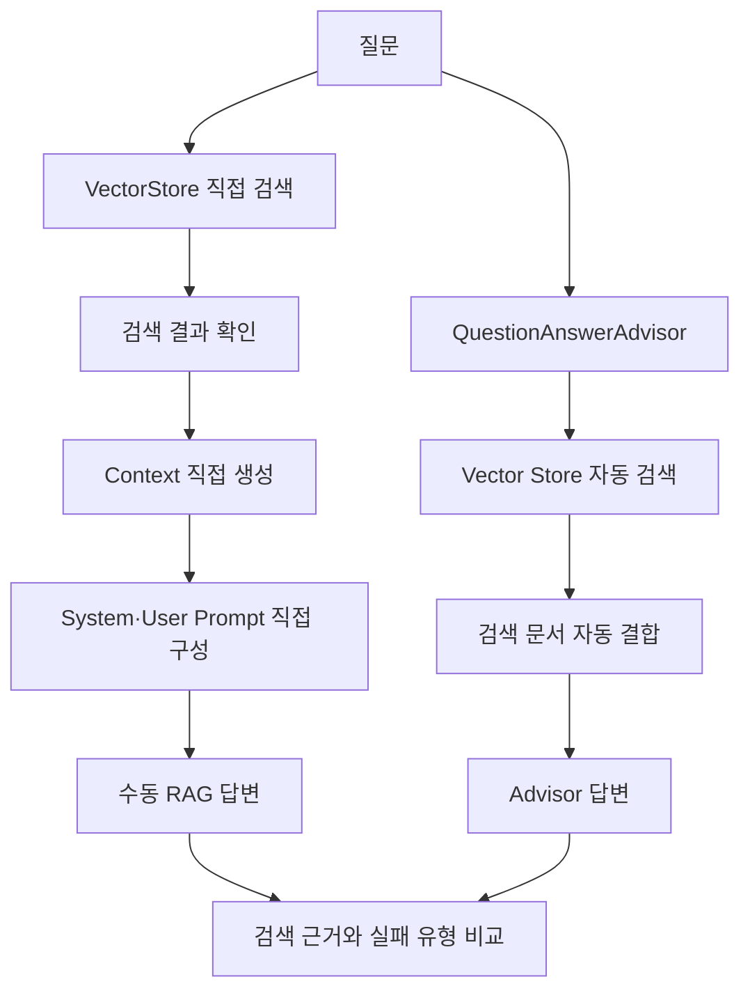

# Phase 3: 수동 RAG와 QuestionAnswerAdvisor

> Phase 2에서 저장한 문서 청크를 검색 문맥으로 구성해 Ollama Chat Model로 답변을 생성하고, 수동 RAG와 `QuestionAnswerAdvisor`의 처리 방식과 실패 결과를 실행값으로 비교한다.

## 1. 범위

| 구분 | 내용 |
| --- | --- |
| 포함 | Ollama Chat Model, `ChatClient`, Phase 2 Vector Store 재사용, 직접 검색, Context 구성, 수동 RAG, `QuestionAnswerAdvisor`, 답변 거부, 실패 유형 구분, 자동 테스트 |
| 제외 | PDF 재처리, 청킹 변경, 임베딩 모델 변경, 문서 재저장, Top-K 비교, Similarity Threshold 비교, 검색·답변 품질 지표, 키워드 검색, 하이브리드 검색, 리랭킹, GraphDB, Azure AI |
| 재사용 | Phase 2의 `PgVectorStore`, 저장 청크 633개, `qwen3-embedding:0.6b`, 기존 메타데이터 |
| 고정 조건 | Top-K 5, Similarity Threshold 0.7, 동일 질문·Vector Store·EmbeddingModel·Chat Model |
| 비교 방식 | 수동 검색 결과와 Context를 직접 확인하고, 두 방식의 생성 답변을 검색 문서 근거와 대조 |

Phase 3에서는 검색 조건을 변경하지 않았다.

검색 결과가 없더라도 임계값을 낮추거나 Top-K를 늘리지 않고, 고정 조건에서 발생한 결과를 Retrieval과 Generation 관점으로 구분했다.

---

## 2. 처리 흐름



```text
수동 RAG
질문
→ VectorStore 직접 검색
→ 검색 결과 확인
→ Context 직접 생성
→ ChatClient 호출
→ 답변 생성

QuestionAnswerAdvisor
질문
→ Advisor 내부 검색
→ 검색 문서 자동 결합
→ ChatClient 호출
→ 답변 생성
```

---

## 3. 개발 환경

| 항목 | 값 |
| --- | --- |
| Java | 21 |
| Spring Boot | 4.1.0 |
| Spring AI | 2.0.0 |
| Gradle | 9.5.1 |
| DSL | Groovy |
| 실행 환경 | Windows PowerShell |
| 애플리케이션 | Non-Web CLI |
| 원본 PDF | `documents/source/graph-engineering-v2026.08.02.pdf` |
| Chat Model 환경 | Ollama |
| Chat Model 구현체 | `OllamaChatModel` |
| Chat Model | `qwen2.5-coder:7b` |
| 임베딩 모델 | `qwen3-embedding:0.6b` |
| 임베딩 차원 | 1,024 |
| Vector Store | `PgVectorStore` |
| PostgreSQL | 17 |
| pgvector 이미지 | `pgvector/pgvector:0.8.5-pg17-bookworm` |
| Vector Store 테이블 | `public.vector_store` |
| 저장 청크 수 | 633 |

### 실행 전 확인

```powershell
Invoke-RestMethod http://localhost:11434/api/tags
ollama list
docker compose ps
```

```powershell
'SELECT COUNT(*) FROM public.vector_store;' |
docker compose exec -T pgvector `
  sh -c 'psql -U "$POSTGRES_USER" -d "$POSTGRES_DB" -tA'
```

#### 결과

| 확인 항목 | 결과 |
| --- | --- |
| Ollama API | 정상 응답 |
| Chat Model | `qwen2.5-coder:7b` |
| 임베딩 모델 | `qwen3-embedding:0.6b` |
| pgvector 컨테이너 | 실행 중 |
| PostgreSQL 포트 | `5432` |
| `vector_store` 행 수 | 633 |

Phase 2에서 저장한 633개 청크를 그대로 사용했다.

문서 삭제, 재처리, 재임베딩, 재저장은 수행하지 않았다.

---

## 4. 의존성과 설정

### 4.1 핵심 의존성

| 의존성 | 용도 |
| --- | --- |
| `spring-ai-starter-model-ollama` | `OllamaChatModel`, `OllamaEmbeddingModel`, `ChatClient.Builder` 자동 구성 |
| `spring-ai-starter-vector-store-pgvector` | `PgVectorStore` 자동 구성 |
| `spring-ai-vector-store-advisor` | `QuestionAnswerAdvisor` |
| `spring-ai-bom:2.0.0` | Spring AI 모듈 버전 관리 |
| `spring-boot-starter-test` | 자동 테스트 |

추가한 의존성:

```groovy
implementation 'org.springframework.ai:spring-ai-vector-store-advisor'
```

### 의존성 확인

```powershell
.\gradlew.bat dependencyInsight `
  --dependency spring-ai-vector-store-advisor `
  --configuration runtimeClasspath
```

#### 결과

| 항목 | 결과 |
| --- | --- |
| Advisor 모듈 | `spring-ai-vector-store-advisor:2.0.0` |
| 버전 결정 | `spring-ai-bom:2.0.0` |
| 런타임 클래스패스 | 포함 |
| 의존성 해석 오류 | 없음 |
| 빌드 | `BUILD SUCCESSFUL in 3s` |

### 4.2 환경 변수

#### `.env.example`

```properties
PGVECTOR_IMAGE=pgvector/pgvector:0.8.5-pg17-bookworm
POSTGRES_DB=spring_ai_rag
POSTGRES_USER=spring_ai_rag
POSTGRES_PASSWORD=<실제 로컬 비밀번호>
POSTGRES_PORT=5432

OLLAMA_CHAT_MODEL=<실제 설치한 Chat Model>
```

실제 실행 환경의 `.env`에는 아래 모델을 지정했다.

```properties
OLLAMA_CHAT_MODEL=qwen2.5-coder:7b
```

### 4.3 애플리케이션 설정

```yaml
spring:
  main:
    web-application-type: none

  ai:
    model:
      chat: ollama
      embedding: ollama

    ollama:
      base-url: http://localhost:11434
      init:
        pull-model-strategy: never
      chat:
        model: ${OLLAMA_CHAT_MODEL}
      embedding:
        model: qwen3-embedding:0.6b

    vectorstore:
      pgvector:
        initialize-schema: true

rag:
  generation:
    enabled: false
    question: ""
    top-k: 5
    similarity-threshold: 0.7
```

| 설정 | 역할 |
| --- | --- |
| `spring.ai.model.chat` | Ollama Chat Model 자동 구성 |
| `spring.ai.ollama.chat.model` | 환경 변수 기반 Chat Model 선택 |
| `rag.generation.enabled` | Phase 3 CLI 실행 여부 |
| `rag.generation.question` | 수동 RAG와 Advisor 공통 질문 |
| `rag.generation.top-k` | 공통 Top-K |
| `rag.generation.similarity-threshold` | 공통 Similarity Threshold |

### 4.4 ChatClient 구성

```java
@Configuration
public class RagChatConfig {

    @Bean
    ChatClient chatClient(
            ChatClient.Builder chatClientBuilder
    ) {
        return chatClientBuilder.build();
    }
}
```

`OllamaChatModel` 자동 구성으로 제공되는 `ChatClient.Builder`를 사용해 공통 `ChatClient` Bean을 생성했다.

---

## 5. 구현 구조

```text
src/main/java/com/example/rag/
├── document/
├── retrieval/
└── generation/
    ├── application/
    │   └── RagService.java
    ├── config/
    │   ├── RagChatConfig.java
    │   └── RagProperties.java
    └── presentation/
        └── cli/
            └── RagRunner.java

src/test/java/com/example/rag/
└── generation/
    └── application/
        └── RagServiceTest.java
```

| 구성요소 | 책임 |
| --- | --- |
| `RagProperties` | 질문, Top-K, Similarity Threshold 설정 바인딩 |
| `RagChatConfig` | 공통 `ChatClient` 생성 |
| `RagService` | 직접 검색, Context 구성, 수동 답변, Advisor 답변 |
| `RagRunner` | CLI 실행과 검색·Context·답변 출력 |
| `RagServiceTest` | 검색 조건 전달과 Context 구성 검증 |
| `PgVectorStore` | Phase 2 저장 청크 검색 |
| `OllamaChatModel` | 검색 문맥 기반 답변 생성 |

Phase 번호는 패키지명과 클래스명에 사용하지 않았다.

---

## 6. 수동 RAG

### 6.1 검색

```java
SearchRequest request =
        SearchRequest.builder()
                .query(question)
                .topK(topK)
                .similarityThreshold(similarityThreshold)
                .build();

List<Document> results =
        vectorStore.similaritySearch(request);
```

`retrieve()`에서 질문과 검색 조건을 `SearchRequest`에 직접 전달했다.

검색 결과가 없을 때 Top-K나 Similarity Threshold를 자동 변경하지 않았다.

### 6.2 Context 구성

검색 결과를 아래 형식으로 변환했다.

```text
[문서]
문서명: graph-engineering-v2026.08.02.pdf
저장된 페이지 범위: 1-453
청크 번호: 실제 chunk_index
내용:
검색된 청크 본문
```

사용한 메타데이터:

```text
file_name
page_number
end_page_number
chunk_index
```

`page_number=1`, `end_page_number=453`은 통합 원본 Document의 전체 페이지 범위다.

청크별 실제 페이지로 해석하지 않았다.

### 6.3 프롬프트

```text
제공된 문서만 사용하여 답변하십시오.
문서에 근거가 없으면 알 수 없다고 답변하십시오.
답변에 사용한 문서명과 저장된 페이지 범위를 표시하십시오.
```

수동 방식에서는 검색 결과와 Context를 직접 확인한 뒤 System Prompt와 User Prompt를 구성했다.

```text
검색 결과 0개
→ Context 빈 문자열
→ 문서 근거 없음
→ 답변 거부
```

---

## 7. QuestionAnswerAdvisor

### 7.1 구성

```java
QuestionAnswerAdvisor advisor =
        QuestionAnswerAdvisor.builder(vectorStore)
                .searchRequest(
                        SearchRequest.builder()
                                .topK(topK)
                                .similarityThreshold(similarityThreshold)
                                .build()
                )
                .build();
```

```java
String answer =
        chatClient.prompt()
                .user(question)
                .advisors(advisor)
                .call()
                .content();
```

`QuestionAnswerAdvisor`가 Vector Store 검색과 검색 문서의 Context 결합을 처리하도록 구성했다.

### 7.2 검색 결과 확인 방식

수동 방식은 `List<Document>`를 직접 반환받아 검색 결과를 출력할 수 있다.

Advisor 방식은 내부 검색 결과를 직접 반환받지 않았다.

검증에서는 아래 조건을 동일하게 고정한 수동 검색 결과와 Advisor 답변을 대조했다.

```text
질문
Top-K 5
Similarity Threshold 0.7
Vector Store
EmbeddingModel
Chat Model
저장 문서
```

Advisor 검색 결과 수와 정답 청크 순위는 임의로 기록하지 않았다.

### 7.3 프롬프트 차이

수동 방식은 문서 기반 답변과 답변 거부를 지시하는 System Prompt를 직접 적용했다.

Advisor 방식은 사용자 질문과 Advisor를 적용하고 수동 방식의 System Prompt는 전달하지 않았다.

실행 결과 비교에는 검색·Context 구성 방식뿐 아니라 프롬프트 구성 차이도 포함된다.

---

## 8. 자동 테스트

### 8.1 실행

```powershell
.\gradlew.bat clean test --console=plain
```

#### 결과

```text
BUILD SUCCESSFUL in 30s
```

| 항목 | 결과 |
| --- | ---: |
| 전체 테스트 | 9개 |
| 성공 | 9개 |
| 실패 | 0개 |
| 건너뜀 | 0개 |
| 성공률 | 100% |
| 테스트 실행 시간 | 22.041초 |
| Gradle 전체 실행 시간 | 30초 |

### 8.2 테스트 클래스별 결과

| 테스트 클래스 | 테스트 수 | 실패 | 실행 시간 |
| --- | ---: | ---: | ---: |
| `DocumentChunkingServiceTest` | 1 | 0 | 8.635초 |
| `PdfDocumentLoaderTest` | 2 | 0 | 2.936초 |
| `TokenDocumentSplitterTest` | 1 | 0 | 2.706초 |
| `VectorSearchServiceTest` | 2 | 0 | 0.103초 |
| `RagServiceTest` | 2 | 0 | 0.558초 |
| `SpringAiRagLabApplicationTests` | 1 | 0 | 보고서 합계에 포함 |

### 8.3 RagServiceTest

| 검증 항목 | 결과 |
| --- | --- |
| 질문 전달 | 성공 |
| Top-K 전달 | 성공 |
| Similarity Threshold 전달 | 성공 |
| `VectorStore.similaritySearch()` 호출 | 성공 |
| 검색 결과 반환 | 성공 |
| 실제 메타데이터 키 사용 | 성공 |
| 검색 결과와 Context 순서 일치 | 성공 |
| 문서명 포함 | 성공 |
| 저장된 페이지 범위 포함 | 성공 |
| 청크 번호 포함 | 성공 |
| 청크 본문 포함 | 성공 |
| 검색되지 않은 문서 미포함 | 성공 |

실제 Chat Model 응답 문장은 고정값으로 테스트하지 않았다.

Ollama Chat 호출과 `QuestionAnswerAdvisor` 연동은 CLI 실행으로 확인했다.

---

## 9. 실행 검증

### 9.1 실행 명령

PowerShell의 한국어 질문 전달을 위해 `SPRING_APPLICATION_JSON`을 사용했다.

```powershell
$env:SPRING_APPLICATION_JSON = @'
{
  "rag": {
    "generation": {
      "enabled": true,
      "question": "그래프 신경망에서 이웃 정보를 집계할 때 어떤 함수를 사용해야 하는가?",
      "top-k": 5,
      "similarity-threshold": 0.7
    }
  }
}
'@

.\gradlew.bat bootRun --console=plain |
  Tee-Object -FilePath .\build\phase3-rag-output.txt

Remove-Item Env:SPRING_APPLICATION_JSON
```

### 9.2 질문 1: 그래프 신경망 집계 함수

```text
질문:
그래프 신경망에서 이웃 정보를 집계할 때 어떤 함수를 사용해야 하는가?

원본 PDF 근거:
순서를 타지 않는 뭉치기(평균·합·최댓값)를 써야 한다
```

고정 조건:

```text
Top-K: 5
Similarity Threshold: 0.7
```

#### 검색 결과

```text
검색 결과 수: 0
수동 RAG Context: 빈 문자열
```

원본 PDF에 관련 내용이 있지만 고정 검색 조건에서는 정답 청크를 확보하지 못했다.

#### 수동 RAG

```text
알 수 없다.
```

| 확인 항목 | 결과 |
| --- | --- |
| 검색 문서 | 없음 |
| Context | 비어 있음 |
| 문서 외 주장 | 없음 |
| 답변 거부 | 성공 |
| 판정 | Retrieval 실패 후 정상 거부 |

#### QuestionAnswerAdvisor

```text
그래프 신경망에서 이웃 정보를 집계할 때 사용하는 함수는 일반적으로
"합" 또는 "평균" 함수입니다. 그러나 더 복잡한 기능을 원한다면,
예를 들어 최대값이나 최소값 등의 다른 함수도 사용될 수 있습니다.
```

| 확인 항목 | 결과 |
| --- | --- |
| Advisor 호출 | 성공 |
| 내부 검색 결과 | 직접 확인 불가 |
| 수동 검색 결과의 근거 | 없음 |
| 답변 거부 | 하지 않음 |
| 판정 | 사전 학습 지식 사용 가능성, Grounding 실패 |

#### 실행 결과

| 항목 | 결과 |
| --- | --- |
| 애플리케이션 시작 | 성공 |
| 수동 `ChatClient` 호출 | 성공 |
| Advisor 호출 | 성공 |
| 빌드 | `BUILD SUCCESSFUL` |
| 실행 시간 | 19초 |
| 로그 | `build/phase3-rag-output.txt` |

### 9.3 질문 2: 컨텍스트 관리

```text
질문:
컨텍스트가 꽉 찼으면 어떻게 해야 하는가?

원본 PDF 근거:
제24장 컨텍스트 관리, 압축, 오프로딩, 프롬프트 캐싱,
장기 기억 저장소와 컨텍스트를 줄이는 방법
```

고정 조건:

```text
Top-K: 5
Similarity Threshold: 0.7
```

#### 검색 결과

```text
검색 결과 수: 0
수동 RAG Context: 빈 문자열
```

원본 PDF에 관련 내용이 있지만 정답 청크를 검색하지 못했다.

#### 수동 RAG

```text
알 수 없다. 제공된 문서에는 관련 정보가 없습니다.
```

#### QuestionAnswerAdvisor

```text
컨텍스트가 꽉 찼으면 새로운 정보를 추가하거나 기존의 정보를 정리하여
필요한 만큼만 유지하는 것이 좋습니다. 필요하지 않은 정보는 삭제하거나
간략화하여 저장할 수 있습니다.
```

#### 판정

| 구분 | 결과 |
| --- | --- |
| Retrieval | 정답 청크 미검색 |
| 수동 RAG | 정상 거부 |
| Advisor | 수동 검색 결과에서 근거를 확인할 수 없는 답변 생성 |
| 실패 유형 | Retrieval 실패, 사전 학습 지식 사용 가능성, Grounding 실패 |
| 검색 조건 변경 | 수행하지 않음 |

### 9.4 실패 유형

| 검색·생성 결과 | 판정 |
| --- | --- |
| 원본 문서에 근거 존재, 검색 결과 0개 | Retrieval 실패 |
| 검색 결과 0개, 수동 답변 거부 | 정상 거부 |
| 검색 근거 없음, Advisor가 정답 형태 답변 생성 | 사전 학습 지식 사용 가능성 |
| 검색 문서에서 근거를 확인할 수 없는 답변 | Grounding 실패 |
| 정답 청크가 Context에 있는 상태의 오답 | 실행 사례 없음 |
| Generation 실패 | 확인하지 못함 |

Phase 3에서는 검색 조건을 변경하지 않았으므로 Retrieval 실패 원인의 개선 실험은 수행하지 않았다.

---

## 10. 수동 RAG와 Advisor 비교

| 항목 | 수동 RAG | QuestionAnswerAdvisor |
| --- | --- | --- |
| 검색 호출 | 직접 구현 | 내부 자동 처리 |
| 검색 결과 확인 | 직접 가능 | 직접 반환받지 않음 |
| Context 구성 | 직접 구현 | 자동 결합 |
| Context 출력 | 가능 | 별도 관찰 필요 |
| 프롬프트 구성 | System·User Prompt 직접 구성 | 사용자 질문과 Advisor 적용 |
| 세부 제어 | 높음 | 기본 흐름 중심 |
| 코드량 | 많음 | 적음 |
| 검색·생성 분리 | 직접 확인 가능 | 내부 처리와 생성 결과 대조 필요 |
| 검색 결과 0개 시 결과 | `알 수 없다` | 일반 지식 형태 답변 |
| 검색 근거 추적 | 가능 | 수동 검색 결과로 대조 |
| 확인된 실패 | Retrieval 실패 후 정상 거부 | 사전 학습 지식 사용 가능성, Grounding 실패 |

### 고정 조건

```text
질문 동일
Top-K 5
Similarity Threshold 0.7
Vector Store 동일
EmbeddingModel 동일
Chat Model 동일
저장 문서 동일
```

### 확인된 차이

수동 RAG는 검색 결과와 Context를 직접 확인할 수 있어 Retrieval 실패와 답변 거부를 구분하기 쉬웠다.

Advisor는 검색과 Context 결합 코드를 줄였지만, 내부 검색 결과를 직접 반환받지 않아 답변 근거 확인에 별도 대조가 필요했다.

검색 결과를 확보하지 못한 실행에서 Advisor는 답변을 거부하지 않고 일반 지식 형태의 응답을 생성했다.

---

## 11. 문제와 수정

| 문제 | 확인된 원인 | 수정 | 결과 |
| --- | --- | --- | --- |
| `qwen2.5-coder:7b` Chat 호출 실패 | 재다운로드 전 Ollama가 Chat 미지원 응답 반환, 내부 원인 확인 불가 | `ollama pull qwen2.5-coder:7b` 재실행 | Chat 호출 성공 |
| `HTTP 400 does not support chat` | Ollama가 Chat 요청 거부 | 모델 재다운로드 후 `ollama show` 확인 | `completion`, `tools`, `insert` 확인 |
| 한글 콘솔 출력 깨짐 | Windows 콘솔과 Java 출력 인코딩 불일치 | UTF-8 코드 페이지와 `JAVA_TOOL_OPTIONS` 적용 | 한글 출력 정상 |
| 한국어 질문 전달 | PowerShell과 `gradlew.bat` 인수 처리 | `SPRING_APPLICATION_JSON` 사용 | 질문 정상 전달 |
| 관련 질문 검색 결과 0개 | 고정 조건에서 정답 청크 미검색 | Phase 3에서는 조건 변경 없이 결과 기록 | Retrieval 실패 확인 |
| Advisor가 문서 근거 없는 답변 생성 | 검색 근거를 확인할 수 없는 상태에서 모델 답변 생성 | 코드 변경 없이 실제 결과 기록 | 사전 학습 지식 사용 가능성·Grounding 실패 확인 |
| Advisor 검색 결과 직접 확인 불가 | 내부 검색 결과를 반환받지 않는 구성 | 동일 조건의 수동 검색 결과와 대조 | 임의 검색 수·순위 기록 제외 |

Chat Model 초기 실패의 내부 원인은 확정하지 못했다.

같은 모델을 다시 내려받은 뒤 capability와 실제 Chat 호출이 정상화된 사실만 기록했다.

---

## 12. 실행 로그

```text
build/phase3-rag-output.txt
```

로그에 포함된 내용:

- 공통 질문
- Top-K
- Similarity Threshold
- 검색 결과 수
- 수동 RAG Context
- 수동 RAG 답변
- `QuestionAnswerAdvisor` 답변
- 애플리케이션 종료 결과

```text
BUILD SUCCESSFUL in 19s
```

---

## 13. 완료 기준

- [x] Ollama Chat Model 설치 확인
- [x] `qwen2.5-coder:7b` 실제 Chat 호출
- [x] `OllamaChatModel` 자동 구성
- [x] `ChatClient.Builder` 주입
- [x] 공통 `ChatClient` 생성
- [x] `spring-ai-vector-store-advisor:2.0.0` 적용
- [x] Phase 2의 `PgVectorStore` 재사용
- [x] 저장 청크 633개 유지
- [x] 문서 재처리·재저장 제외
- [x] 질문 기반 `VectorStore` 직접 검색
- [x] Top-K 5 고정
- [x] Similarity Threshold 0.7 고정
- [x] 검색 결과 출력
- [x] 실제 메타데이터 키 기반 Context 구성
- [x] 검색 결과와 Context 순서 자동 테스트
- [x] 수동 `ChatClient` 답변 생성
- [x] 검색 결과 없음 상태의 정상 답변 거부
- [x] `QuestionAnswerAdvisor` 적용
- [x] Advisor 기반 답변 생성
- [x] 수동 방식과 Advisor의 공통 검색 조건 적용
- [x] Retrieval 실패 확인
- [x] 사전 학습 지식 사용 가능성 확인
- [x] Grounding 실패 확인
- [x] 전체 테스트 9개 성공
- [x] 실제 Ollama·pgvector 연동
- [x] 실행 로그 저장
- [x] Top-K·Similarity Threshold 비교 제외
- [x] 검색 품질 지표 제외
- [x] 검색 방식 개선 제외
- [x] Phase 4 이후 기능 미포함

Generation 실패는 정답 청크가 검색되고 Context에 근거가 포함된 실행 사례가 없어 확인하지 못했다.

---

## Phase 3 결과

| 항목 | 결과 |
| --- | --- |
| Chat Model 구현체 | `OllamaChatModel` |
| Chat Model | `qwen2.5-coder:7b` |
| EmbeddingModel | `OllamaEmbeddingModel` |
| 임베딩 모델 | `qwen3-embedding:0.6b` |
| Vector Store | `PgVectorStore` |
| 재사용 청크 | 633개 |
| 검색 조건 | Top-K 5, Similarity Threshold 0.7 |
| 수동 검색 결과 | 관련 질문 2건 모두 0개 |
| 수동 RAG | 검색 결과 없음 상태에서 답변 거부 |
| Advisor | 검색 근거를 확인할 수 없는 일반 지식 형태 답변 |
| Retrieval 실패 | 확인 |
| Generation 실패 | 확인하지 못함 |
| 정상 거부 | 확인 |
| 사전 학습 지식 사용 가능성 | 확인 |
| Grounding 실패 | 확인 |
| `RagServiceTest` | 2개 성공 |
| 전체 테스트 | 9개 성공, 실패 0개 |
| 실행 결과 | `BUILD SUCCESSFUL` |
| 로그 | `build/phase3-rag-output.txt` |
| 확인된 한계 | 고정 조건에서 정답 청크 미검색, Advisor 내부 검색 결과 직접 확인 불가, 수동·Advisor 프롬프트 구성 차이 |
