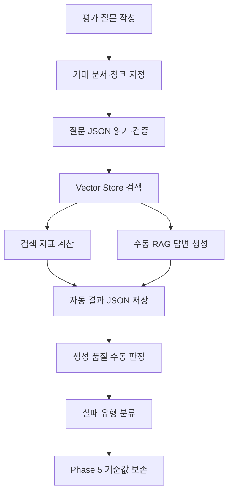

# Phase 4: 검색·생성 품질 평가

> Phase 3에서 구성한 수동 RAG를 동일한 검색·생성 조건으로 실행해 검색 품질과 생성 품질을 측정하고, Phase 5 검색 개선 전 기준값을 확보한다.

## 1. 범위

| 구분 | 내용 |
| --- | --- |
| 포함 | 평가 질문과 기대 결과 정의, 질문 JSON 읽기·검증, `RagService` 재사용, Hit@5, Recall@5, Precision@5, MRR, 수동 생성 품질 판정, 실패 유형 분류, 결과 JSON 저장, 자동 테스트 |
| 제외 | PDF 재처리, 청킹 변경, 임베딩 모델 변경, Chat Model 변경, 프롬프트 변경, Top-K 변경, Similarity Threshold 변경, 키워드 검색, 하이브리드 검색, RRF, 리랭킹, GraphDB, Azure AI |
| 재사용 | Phase 3의 `RagService.retrieve()`, `RagService.answerManually()`, `PgVectorStore`, 저장 청크 633개, 기존 메타데이터 |
| 고정 조건 | Top-K 5, Similarity Threshold 0.7, 동일 문서·Vector Store·EmbeddingModel·Chat Model·프롬프트 |
| 평가 방식 | 기대 문서·청크를 검색 전에 지정하고, 자동 검색 지표와 수동 생성 품질 판정을 분리해 저장 |

Phase 4에서는 검색 설정이나 검색 방식을 변경하지 않았다.

검색 결과가 없더라도 임계값을 낮추거나 Top-K를 늘리지 않고, 현재 구성에서 발생한 Retrieval 실패와 Generation 실패를 구분했다.

---

## 2. 처리 흐름



```text
평가 질문과 기대 청크 사전 확정
→ 질문 JSON 읽기·검증
→ 기존 RagService로 검색
→ Hit@5·Recall@5·Precision@5·MRR 계산
→ 기존 수동 RAG로 답변 생성
→ 자동 결과 저장
→ 생성 품질 수동 판정
→ 실패 유형 분류
→ Phase 5 비교 기준값 보존
```

---

## 3. 개발 환경

| 항목 | 값 |
| --- | --- |
| Java | 21 |
| Spring Boot | 4.1.0 |
| Spring AI | 2.0.0 |
| Gradle | 9.5.1 |
| DSL | Groovy |
| 실행 환경 | Windows PowerShell |
| 애플리케이션 | Non-Web CLI |
| 원본 PDF | `documents/source/graph-engineering-v2026.08.02.pdf` |
| Chat Model 환경 | Ollama |
| Chat Model 구현체 | `OllamaChatModel` |
| Chat Model | `qwen2.5-coder:7b` |
| 임베딩 모델 | `qwen3-embedding:0.6b` |
| 임베딩 차원 | 1,024 |
| Vector Store | `PgVectorStore` |
| PostgreSQL | 17 |
| pgvector 이미지 | `pgvector/pgvector:0.8.5-pg17-bookworm` |
| Vector Store 테이블 | `public.vector_store` |
| 저장 청크 수 | 633 |

### 실행 전 확인

```powershell
ollama list
docker compose ps
```

```powershell
'SELECT COUNT(*) FROM public.vector_store;' |
docker compose exec -T pgvector `
  sh -c 'psql -U "$POSTGRES_USER" -d "$POSTGRES_DB" -tA'
```

#### 결과

| 확인 항목 | 결과 |
| --- | --- |
| Chat Model | `qwen2.5-coder:7b` |
| 임베딩 모델 | `qwen3-embedding:0.6b` |
| pgvector 컨테이너 | 실행 중 |
| `public.vector_store` | 존재 |
| `id` | `uuid`, `NOT NULL`, 기본값 `uuid_generate_v4()` |
| `content` | `text` |
| `metadata` | `json` |
| `embedding` | `vector(1024)` |
| 저장 청크 수 | 633 |

Phase 2에서 저장한 633개 청크를 그대로 평가 대상으로 사용했다.

문서 재처리, 재임베딩, 재저장은 수행하지 않았다.

---

## 4. 의존성과 설정

### 4.1 핵심 의존성

| 의존성 | 용도 |
| --- | --- |
| `spring-boot-starter-json` | 평가 질문 JSON 읽기와 결과 JSON 저장 |
| `spring-ai-starter-model-ollama` | `OllamaChatModel`, `OllamaEmbeddingModel`, `ChatClient.Builder` 자동 구성 |
| `spring-ai-starter-vector-store-pgvector` | `PgVectorStore` 자동 구성 |
| `spring-ai-vector-store-advisor` | Phase 3 구성 유지 |
| `spring-ai-bom:2.0.0` | Spring AI 모듈 버전 관리 |
| `spring-boot-starter-test` | 자동 테스트 |

추가한 의존성:

```groovy
implementation 'org.springframework.boot:spring-boot-starter-json'
```

### 의존성 확인

```powershell
.\gradlew.bat dependencyInsight `
  --dependency spring-boot-starter-json `
  --configuration runtimeClasspath
```

#### 결과

| 항목 | 결과 |
| --- | --- |
| Starter | `spring-boot-starter-json:4.1.0` |
| 런타임 클래스패스 | 포함 |
| 의존성 해석 오류 | 없음 |
| 빌드 | `BUILD SUCCESSFUL` |

### 4.2 애플리케이션 설정

```yaml
rag:
  document:
    enabled: false

  retrieval:
    enabled: false
    store: false
    search: false

  generation:
    enabled: false
    question: ""
    top-k: 5
    similarity-threshold: 0.7

  evaluation:
    enabled: false
    questions-path: evaluation/questions.json
    results-path: evaluation/results/phase4-results.json
    top-k: 5
    similarity-threshold: 0.7
```

| 설정 | 역할 |
| --- | --- |
| `rag.evaluation.enabled` | Phase 4 CLI 실행 여부 |
| `rag.evaluation.questions-path` | 평가 질문 파일 경로 |
| `rag.evaluation.results-path` | 자동 평가 결과 저장 경로 |
| `rag.evaluation.top-k` | 검색 결과 수 |
| `rag.evaluation.similarity-threshold` | 최소 유사도 임계값 |

평가 실행 시 기존 문서 처리, 검색 CLI, RAG CLI는 비활성화했다.

### 4.3 EvaluationProperties

```java
@ConfigurationProperties(prefix = "rag.evaluation")
public record EvaluationProperties(
        boolean enabled,
        Path questionsPath,
        Path resultsPath,
        int topK,
        double similarityThreshold
) {
}
```

기존 `@ConfigurationPropertiesScan`을 사용해 별도 등록 코드는 추가하지 않았다.

---

## 5. 구현 구조

```text
src/main/java/com/example/rag/
├── document/
├── retrieval/
├── generation/
└── evaluation/
    ├── application/
    │   ├── EvaluationService.java
    │   ├── RetrievalMetricCalculator.java
    │   └── model/
    │       ├── EvaluationQuestion.java
    │       ├── RetrievedChunk.java
    │       ├── RetrievalMetrics.java
    │       ├── EvaluationCaseResult.java
    │       └── EvaluationSummary.java
    ├── config/
    │   └── EvaluationProperties.java
    ├── infrastructure/
    │   └── json/
    │       ├── EvaluationQuestionLoader.java
    │       └── EvaluationResultWriter.java
    └── presentation/
        └── cli/
            └── EvaluationRunner.java

src/test/java/com/example/rag/
└── evaluation/
    └── application/
        ├── RetrievalMetricCalculatorTest.java
        └── EvaluationServiceTest.java
```

| 구성요소 | 책임 |
| --- | --- |
| `EvaluationProperties` | 평가 실행 설정 바인딩 |
| `EvaluationQuestionLoader` | 질문 JSON 읽기와 데이터 검증 |
| `EvaluationQuestion` | 질문, 유형, 기대 문서·청크 저장 |
| `RetrievedChunk` | 검색 순위, 청크 ID, 점수, 관련성 저장 |
| `RetrievalMetrics` | 질문별 Hit@5, Recall@5, Precision@5, Reciprocal Rank 저장 |
| `EvaluationCaseResult` | 검색 결과, 생성 답변, 수동 판정값 저장 |
| `EvaluationSummary` | 전체 질문 수, 유형별 개수, 평균 검색 지표 저장 |
| `RetrievalMetricCalculator` | 질문별·전체 검색 지표 계산 |
| `EvaluationService` | 기존 검색·수동 RAG 재사용과 질문별 평가 실행 |
| `EvaluationResultWriter` | 자동 평가 결과 JSON 저장 |
| `EvaluationRunner` | CLI 실행과 평가 요약 출력 |

Phase 번호는 패키지명과 클래스명에 사용하지 않았다.

---

## 6. 평가 데이터

### 6.1 질문 유형

| 질문 유형 | 코드 | 질문 수 |
| --- | --- | ---: |
| 정확한 용어 | `exact-term` | 1 |
| 의미 변환 | `semantic-paraphrase` | 1 |
| 답이 없는 질문 | `unanswerable` | 1 |
| 버전·식별자 | `version-identifier` | 0 |
| 복수 문서 | `multi-document` | 0 |

현재 Vector Store에는 문서 한 개만 저장돼 있어 복수 문서 질문은 구성하지 않았다.

버전·식별자 질문으로 확정할 근거도 사용하지 않아 질문 수를 0으로 기록했다.

### 6.2 평가 질문

파일 경로:

```text
evaluation/questions.json
```

| 질문 ID | 유형 | 질문 | 기대 청크 | 답변 가능 |
| --- | --- | --- | --- | --- |
| `q-001` | `exact-term` | 지식과 실행을 한 그래프에 합친다는 것은 무엇인가? | `graph-engineering-v2026.08.02.pdf#461` | `true` |
| `q-002` | `semantic-paraphrase` | 에이전트 실행이 어떤 사실을 읽었는지 추적하려면 그래프를 어떻게 구성해야 하는가? | `graph-engineering-v2026.08.02.pdf#461` | `true` |
| `q-003` | `unanswerable` | Spring AI가 제공하는 양자 암호화 알고리즘은 무엇인가? | 없음 | `false` |

기대 문서와 기대 청크는 평가용 유사도 검색을 실행하기 전에 확정했다.

평가 실행 결과를 확인한 뒤 질문이나 기대 청크를 변경하지 않았다.

### 6.3 기대 청크 확인

`q-001`, `q-002`의 기대 청크는 아래 식별자를 사용했다.

```text
graph-engineering-v2026.08.02.pdf#461
```

청크 ID 형식:

```text
<file_name>#<chunk_index>
```

청크 `461`에는 지식 노드와 실행 노드를 같은 그래프에 두고, 실행이 어떤 사실을 읽었는지 엣지로 연결하는 내용이 포함돼 있다.

### 6.4 답이 없는 질문 확인

```sql
SELECT COUNT(*) AS matched_chunk_count
FROM public.vector_store
WHERE content ILIKE '%Spring AI%'
   OR content ILIKE '%양자 암호화%'
   OR content ILIKE '%양자 암호화 알고리즘%';
```

#### 결과

```text
matched_chunk_count: 0
```

`q-003`은 기대 문서와 기대 청크를 빈 배열로 지정했다.

### 6.5 질문 데이터 검증

| 검증 항목 | 결과 |
| --- | --- |
| 질문 파일 존재 | 성공 |
| 질문 파일 읽기 가능 | 성공 |
| 빈 질문 목록 차단 | 구현 |
| 질문 ID 누락 차단 | 구현 |
| 질문 ID 중복 차단 | 구현 |
| 질문 본문 누락 차단 | 구현 |
| 지원하지 않는 유형 차단 | 구현 |
| 답변 가능 질문의 기대 문서·청크 필수 검증 | 구현 |
| 답이 없는 질문의 기대 문서·청크 빈 배열 검증 | 구현 |
| 실제 질문 ID 중복 | 없음 |
| 실제 JSON 구조 | 정상 |

---

## 7. 검색 지표 계산

### 7.1 지표 기준

답변 가능한 질문만 전체 검색 지표 계산에 포함했다.

#### Hit@5

```text
정답 청크가 Top-5에 하나 이상 포함됨 → 1
정답 청크가 포함되지 않음 → 0
```

#### Recall@5

```text
검색된 고유 정답 청크 수 / 필요한 전체 정답 청크 수
```

#### Precision@5

```text
검색된 고유 정답 청크 수 / 실제 반환된 검색 결과 수
```

검색 결과가 없으면 `0.0`으로 처리했다.

#### MRR

```text
질문별 Reciprocal Rank = 1 / 첫 정답 청크 순위
MRR = 답변 가능 질문의 Reciprocal Rank 평균
```

첫 정답 청크가 없으면 Reciprocal Rank를 `0.0`으로 처리했다.

답이 없는 질문은 Hit@5, Recall@5, Precision@5, MRR 계산에서 제외하고 질문별 지표를 `null`로 저장했다.

### 7.2 구현 기준

| 항목 | 구현 |
| --- | --- |
| 기대 청크 중 검색된 고유 청크 수 계산 | 완료 |
| 질문별 Hit@5 | 완료 |
| 질문별 Recall@5 | 완료 |
| 질문별 Precision@5 | 완료 |
| 질문별 Reciprocal Rank | 완료 |
| 답변 가능 질문만 전체 평균 포함 | 완료 |
| 답이 없는 질문의 지표 `null` 처리 | 완료 |
| 답변 가능 질문이 없는 실행 차단 | 완료 |
| 질문 유형별 개수 집계 | 완료 |

---

## 8. 평가 실행과 결과 저장

### 8.1 기존 RagService 재사용

```text
RagService.retrieve()
→ 질문별 Vector Store 검색

RagService.answerManually()
→ 기존 Context와 System Prompt를 사용한 답변 생성
```

Phase 4 전용 검색 방식이나 프롬프트는 추가하지 않았다.

`Document` 메타데이터의 `file_name`과 `chunk_index`를 결합해 평가용 청크 ID를 생성했다.

```text
file_name#chunk_index
```

검색 결과에는 순위, 문서 ID, 청크 ID, 유사도 점수, 기대 청크 여부, 메타데이터, 본문을 저장했다.

### 8.2 자동 결과 저장

파일 경로:

```text
evaluation/results/phase4-results.json
```

자동 실행에서 저장한 값:

- 실행 조건
- 질문 수
- 질문 유형별 개수
- 답변 가능·불가능 질문 수
- 전체 검색 지표
- 질문별 기대 문서와 기대 청크
- 질문별 검색 결과와 검색 지표
- 질문별 생성 답변
- 수동 판정 전 `null` 값
- 초기 실패 유형 `UNREVIEWED`

자동 결과에는 수동 판정값을 입력하지 않았다.

### 8.3 수동 검토 결과 저장

파일 경로:

```text
evaluation/results/phase4-results-reviewed.json
```

`phase4-results.json`을 복사한 뒤 수동 판정 필드만 변경했다.

질문, 기대 결과, 검색 결과, 검색 지표, 생성 답변은 유지했다.

---

## 9. 자동 테스트

### 9.1 실행

```powershell
.\gradlew.bat clean test --console=plain
```

#### 결과

```text
BUILD SUCCESSFUL in 35s
```

| 항목 | 결과 |
| --- | ---: |
| 전체 테스트 | 12개 |
| 성공 | 12개 |
| 실패 | 0개 |
| 건너뜀 | 0개 |
| 성공률 | 100% |
| 테스트 실행 시간 | 25.541초 |
| Gradle 전체 실행 시간 | 35초 |

### 9.2 테스트 클래스별 결과

| 테스트 클래스 | 테스트 수 | 실패 | 실행 시간 |
| --- | ---: | ---: | ---: |
| `DocumentChunkingServiceTest` | 1 | 0 | 10.348초 |
| `PdfDocumentLoaderTest` | 2 | 0 | 3.321초 |
| `TokenDocumentSplitterTest` | 1 | 0 | 2.749초 |
| `EvaluationServiceTest` | 1 | 0 | 0.398초 |
| `RetrievalMetricCalculatorTest` | 2 | 0 | 0.007초 |
| `RagServiceTest` | 2 | 0 | 0.330초 |
| `VectorSearchServiceTest` | 2 | 0 | 0.044초 |
| `SpringAiRagLabApplicationTests` | 1 | 0 | 보고서 합계에 포함 |

### 9.3 RetrievalMetricCalculatorTest

| 검증 항목 | 결과 |
| --- | --- |
| Hit@5 계산 | 성공 |
| Recall@5 계산 | 성공 |
| Precision@5 계산 | 성공 |
| Reciprocal Rank 계산 | 성공 |
| 답이 없는 질문의 검색 지표 제외 | 성공 |

계산 검증값:

```text
기대 청크 수: 2
검색된 기대 청크 수: 1
첫 정답 청크 순위: 2
검색 결과 수: 5

Hit@5 = 1
Recall@5 = 0.5
Precision@5 = 0.2
Reciprocal Rank = 0.5
```

### 9.4 EvaluationServiceTest

| 검증 항목 | 결과 |
| --- | --- |
| `RagService.retrieve()` 호출 | 성공 |
| `RagService.answerManually()` 호출 | 성공 |
| 검색 순위 부여 | 성공 |
| `file_name#chunk_index` 생성 | 성공 |
| 기대 청크의 `relevant=true` 판정 | 성공 |
| 전체 검색 지표 집계 | 성공 |
| 생성 답변 저장 | 성공 |
| 초기 실패 유형 `UNREVIEWED` | 성공 |
| 수동 평가값 `null` 유지 | 성공 |

실제 Chat Model 응답 문장은 고정값으로 테스트하지 않았다.

Ollama Chat 호출과 pgvector 검색은 CLI 실행으로 확인했다.

---

## 10. 실행 검증

### 10.1 실행 명령

```powershell
$env:SPRING_APPLICATION_JSON = @'
{
  "rag": {
    "document": {
      "enabled": false
    },
    "retrieval": {
      "enabled": false
    },
    "generation": {
      "enabled": false
    },
    "evaluation": {
      "enabled": true,
      "questions-path": "evaluation/questions.json",
      "results-path": "evaluation/results/phase4-results.json",
      "top-k": 5,
      "similarity-threshold": 0.7
    }
  }
}
'@

.\gradlew.bat bootRun --console=plain |
  Tee-Object -FilePath .\build\phase4-evaluation-output.txt

Remove-Item Env:SPRING_APPLICATION_JSON
```

### 10.2 실행 결과

| 항목 | 결과 |
| --- | --- |
| 질문 수 | 3 |
| 답변 가능 질문 수 | 2 |
| 답이 없는 질문 수 | 1 |
| 질문 유형별 개수 | `exact-term` 1개, `semantic-paraphrase` 1개, `unanswerable` 1개 |
| Top-K | 5 |
| Similarity Threshold | 0.7 |
| Hit@5 | 0.0000 |
| Recall@5 | 0.0000 |
| Precision@5 | 0.0000 |
| MRR | 0.0000 |
| 자동 결과 파일 | 생성 성공 |
| 실행 로그 | 생성 성공 |
| 빌드 | `BUILD SUCCESSFUL` |

### 10.3 질문별 검색·생성 결과

#### q-001: 정확한 용어

```text
질문:
지식과 실행을 한 그래프에 합친다는 것은 무엇인가?

기대 청크:
graph-engineering-v2026.08.02.pdf#461
```

| 항목 | 결과 |
| --- | --- |
| 검색 결과 수 | 0 |
| Hit@5 | 0 |
| Recall@5 | 0.0 |
| Precision@5 | 0.0 |
| Reciprocal Rank | 0.0 |
| 생성 답변 | 문서 근거 부족으로 답변 거부 |

#### q-002: 의미 변환

```text
질문:
에이전트 실행이 어떤 사실을 읽었는지 추적하려면 그래프를 어떻게 구성해야 하는가?

기대 청크:
graph-engineering-v2026.08.02.pdf#461
```

| 항목 | 결과 |
| --- | --- |
| 검색 결과 수 | 0 |
| Hit@5 | 0 |
| Recall@5 | 0.0 |
| Precision@5 | 0.0 |
| Reciprocal Rank | 0.0 |
| 생성 답변 | 문서 근거 부족으로 답변 거부 |

#### q-003: 답이 없는 질문

```text
질문:
Spring AI가 제공하는 양자 암호화 알고리즘은 무엇인가?
```

| 항목 | 결과 |
| --- | --- |
| 검색 결과 수 | 0 |
| Hit@5 | 평가 제외 |
| Recall@5 | 평가 제외 |
| Precision@5 | 평가 제외 |
| Reciprocal Rank | 평가 제외 |
| 생성 답변 | 문서에 근거가 없다고 답변 거부 |

답이 없는 질문의 검색 지표는 `null`로 저장했다.

---

## 11. 생성 품질 수동 평가

### 11.1 평가 항목

| 평가 항목 | 확인 내용 |
| --- | --- |
| Answer Correct | 기대 답과 일치하는가 |
| Groundedness | 답변이 검색 청크에 근거하는가 |
| Relevance | 질문에 직접 답하는가 |
| Completeness | 필요한 내용을 포함하는가 |
| Citation Accuracy | 표시한 출처가 실제 근거와 일치하는가 |
| Unsupported Claim | 검색 청크에 없는 주장이 있는가 |
| Refusal Accuracy | 답이 없는 질문을 거부하는가 |

출처 표시가 없는 답변의 `citationAccuracy`는 `false`가 아니라 `null`로 유지했다.

### 11.2 질문별 판정

| 질문 ID | 첫 정답 순위 | Hit@5 | 답변 정확 | 근거 일치 | Unsupported Claim | 거부 정확 | 실패 유형 |
| --- | ---: | ---: | --- | --- | --- | --- | --- |
| `q-001` | 없음 | 0 | 실패 | 성공 | 없음 | 평가 제외 | `RETRIEVAL_FAILURE` |
| `q-002` | 없음 | 0 | 실패 | 성공 | 없음 | 평가 제외 | `RETRIEVAL_FAILURE` |
| `q-003` | 평가 제외 | 평가 제외 | 성공 | 성공 | 없음 | 성공 | `NORMAL_REFUSAL` |

### 11.3 생성 평가 결과

| 항목 | 결과 |
| --- | ---: |
| Groundedness 실패 | 0건 |
| Unsupported Claim | 0건 |
| 답변 거부 성공 | 1건 |
| 답변 거부 실패 | 0건 |
| Retrieval 실패 질문 | `q-001`, `q-002` |
| Generation 실패 질문 | 없음 |

`q-001`, `q-002`는 기대 청크가 검색되지 않아 답변 가능한 질문에 답하지 못했다.

검색 근거가 없으므로 Generation 실패로 분류하지 않았다.

`q-003`은 저장 문서에 근거가 없는 질문에 구체적인 내용을 생성하지 않고 답변을 거부했다.

---

## 12. 실패 유형 분석

### 12.1 분류 기준

| 검색 결과 | 생성 결과 | 실패 유형 |
| --- | --- | --- |
| 정답 청크 있음 | 정답 | `NORMAL` |
| 정답 청크 없음 | 오답 또는 답변 불가 | `RETRIEVAL_FAILURE` |
| 정답 청크 있음 | 오답 | `GENERATION_FAILURE` |
| 정답 청크 없음 | 정답 형태 답변 | `RETRIEVAL_FAILURE` |
| 관련 근거 없음 | 답변 거부 | `NORMAL_REFUSAL` |
| 관련 근거 없음 | 구체 답변 생성 | `REFUSAL_FAILURE` |
| 수동 검토 전 | 미판정 | `UNREVIEWED` |

### 12.2 확인된 실패

| 질문 | 검색 결과 | 생성 결과 | 판정 |
| --- | --- | --- | --- |
| `q-001` | 기대 청크 미검색 | 답변 거부 | `RETRIEVAL_FAILURE` |
| `q-002` | 기대 청크 미검색 | 답변 거부 | `RETRIEVAL_FAILURE` |
| `q-003` | 관련 근거 없음 | 답변 거부 | `NORMAL_REFUSAL` |

Generation 실패는 정답 청크가 검색된 상태에서 오답을 생성한 사례가 없어 확인하지 못했다.

### 12.3 직접 원인

`q-001`, `q-002`는 Top-K 5, Similarity Threshold 0.7 조건에서 검색 결과가 빈 목록으로 반환됐다.

```text
retrievedChunks: []
```

기대 청크가 Vector Store에 저장된 사실은 SQL 조회로 확인했다.

검색 결과가 비어 있게 된 근본 원인이 질문 표현, 임베딩 유사도, 청크 내용, 유사도 임계값 중 어느 항목인지는 Phase 4 결과만으로 확정할 수 없다.

```text
근본 원인: 확인 불가
```

Phase 4에서는 고정 조건을 유지해야 하므로 검색 설정 변경이나 개선 실험은 수행하지 않았다.

---

## 13. 문제와 한계

| 문제·한계 | 확인된 내용 | 처리 |
| --- | --- | --- |
| 기대 청크 미검색 | `q-001`, `q-002`의 검색 결과가 빈 목록 | 고정 조건에서 Retrieval 실패로 기록 |
| 검색 지표 전부 0.0 | 답변 가능 질문 2개 모두 Hit@5가 0 | 실제 실행값 보존 |
| Generation 실패 미확인 | 정답 청크가 검색된 실행 사례 없음 | 확인하지 못한 결과로 기록 |
| Citation Accuracy 미평가 | 생성 답변에 출처 표시 없음 | `null` 유지 |
| 버전·식별자 질문 없음 | 현재 평가 데이터에서 확정하지 않음 | 질문 수 0개 기록 |
| 복수 문서 질문 없음 | 저장 문서가 한 개 | 질문 수 0개 기록 |
| 근본 검색 실패 원인 | Phase 4 고정 조건만으로 구분 불가 | `확인 불가` 기록 |

실패 결과를 이유로 질문, 기대 청크, Top-K, Similarity Threshold, 모델, 프롬프트를 변경하지 않았다.

---

## 14. 실행 로그와 결과 파일

```text
build/phase4-evaluation-output.txt
evaluation/questions.json
evaluation/results/phase4-results.json
evaluation/results/phase4-results-reviewed.json
```

| 파일 | 내용 |
| --- | --- |
| `evaluation/questions.json` | 평가 질문, 유형, 기대 문서·청크 |
| `phase4-results.json` | 자동 검색·생성 결과와 미검토 상태 |
| `phase4-results-reviewed.json` | 수동 생성 품질 판정과 실패 유형 |
| `phase4-evaluation-output.txt` | CLI 실행 요약과 빌드 결과 |

자동 실행 결과와 수동 검토 결과를 분리해 원본 평가값을 보존했다.

---

## 15. 완료 기준

- [x] `evaluation/questions.json` 작성
- [x] 기대 문서와 기대 청크 사전 지정
- [x] 질문 JSON 읽기 구현
- [x] 질문 데이터 검증 구현
- [x] 평가용 청크 ID 생성
- [x] 기존 `RagService.retrieve()` 재사용
- [x] 기존 `RagService.answerManually()` 재사용
- [x] Hit@5 계산
- [x] Recall@5 계산
- [x] Precision@5 계산
- [x] MRR 계산
- [x] 답이 없는 질문의 검색 지표 제외
- [x] 평가 결과 JSON 저장
- [x] 생성 품질 수동 판정
- [x] Retrieval 실패 질문 식별
- [x] Generation 실패 질문 식별
- [x] 답변 거부 성공·실패 식별
- [x] Groundedness 실패 건수 기록
- [x] Unsupported Claim 건수 기록
- [x] 전체 테스트 성공
- [x] 실제 평가 실행 성공
- [x] 자동 실행 결과 보존
- [x] 수동 검토 결과 보존
- [x] Phase 5 비교용 기준값 확정

Generation 실패는 정답 청크가 검색된 실행 사례가 없어 확인하지 못했다.

---

## Phase 4 결과

| 항목 | 결과 |
| --- | --- |
| 평가 질문 | 3개 |
| 질문 유형 | `exact-term` 1개, `semantic-paraphrase` 1개, `unanswerable` 1개 |
| 답변 가능 질문 | 2개 |
| 답이 없는 질문 | 1개 |
| 재사용 청크 | 633개 |
| 검색 조건 | Top-K 5, Similarity Threshold 0.7 |
| Hit@5 | 0.0000 |
| Recall@5 | 0.0000 |
| Precision@5 | 0.0000 |
| MRR | 0.0000 |
| Retrieval 실패 | `q-001`, `q-002` |
| Generation 실패 | 확인하지 못함 |
| 정상 거부 | `q-003` |
| 거부 실패 | 없음 |
| Groundedness 실패 | 0건 |
| Unsupported Claim | 0건 |
| 자동 결과 | `evaluation/results/phase4-results.json` |
| 수동 검토 결과 | `evaluation/results/phase4-results-reviewed.json` |
| 전체 테스트 | 12개 성공, 실패 0개 |
| 실행 결과 | `BUILD SUCCESSFUL` |
| 로그 | `build/phase4-evaluation-output.txt` |
| Phase 5 기준값 | 확정 |
| 확인된 한계 | 고정 조건에서 기대 청크 미검색, 검색 실패 근본 원인 확인 불가, Generation 실패 사례 없음 |

Phase 4 결과는 Phase 5의 키워드 검색, 하이브리드 검색, RRF, 리랭킹 적용 전 기준값으로 사용한다.
