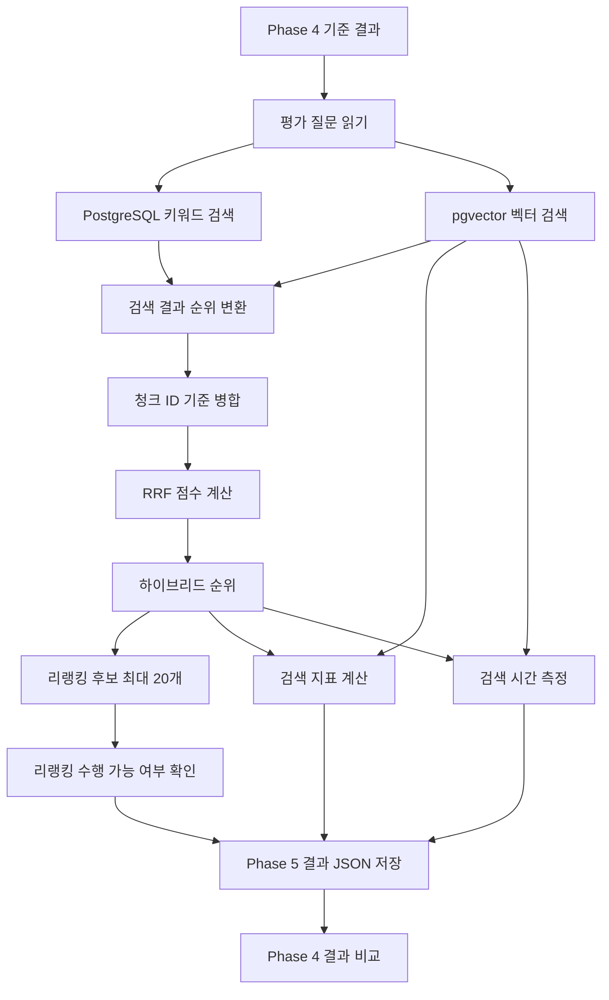

# Phase 5: 검색 방식 개선

> Phase 4에서 확인한 Retrieval 실패 질문을 동일한 문서와 평가 조건으로 재실행하고, PostgreSQL Full-text Search, pgvector 검색, RRF 하이브리드 검색의 품질과 검색 시간을 비교한다.

## 1. 범위

| 구분    | 내용                                                                                                                                                                                                          |
| ----- | ----------------------------------------------------------------------------------------------------------------------------------------------------------------------------------------------------------- |
| 포함    | PostgreSQL Full-text Search 기반 키워드 검색, 기존 pgvector 벡터 검색 재실행, 청크 ID 기준 결과 병합, RRF 점수 계산, 하이브리드 검색, RRF `k` 비교, 리랭킹 후보 20개 생성 조건 실행, Hit@5, Recall@5, Precision@5, MRR, 검색 시간 측정, Phase 4 기준값 비교, 결과 JSON 저장 |
| 제외    | PDF 재처리, 청킹 변경, 저장 청크 변경, 임베딩 모델 변경, Chat Model 변경, 프롬프트 변경, 생성 답변 평가, GraphDB, Graph 기반 RAG, Azure AI, Azure AI Search                                                                                     |
| 재사용   | Phase 4 평가 질문, 기대 문서·청크, `EvaluationQuestionLoader`, `RetrievalMetricCalculator`, `RetrievedChunk`, `RetrievalMetrics`, 기존 `VectorSearchService`, `PgVectorStore`, 저장 청크 633개                               |
| 고정 조건 | 동일 문서, 동일 저장 청크, 동일 평가 질문, 동일 기대 청크, Vector Top-K 5, Similarity Threshold 0.7, 동일 임베딩 모델                                                                                                                    |
| 변경 조건 | 검색 방식, RRF `k`, 리랭킹 후보 수                                                                                                                                                                                    |
| 평가 방식 | Phase 4 기준값과 Phase 5 벡터·하이브리드 검색 결과 비교, 답변 가능 질문의 검색 지표 계산, 전체 질문의 검색 시간 측정                                                                                                                                 |

Phase 5에서는 프롬프트와 Chat Model을 변경하지 않았다.

생성 답변 품질은 다시 평가하지 않았다.

리랭킹 후보가 생성되지 않아 리랭킹 구현과 전후 비교는 수행하지 않았다.

---

## 2. 처리 흐름



```text
Phase 4 기준 결과 읽기
→ 평가 질문 유지
→ PostgreSQL 키워드 검색
→ 기존 pgvector 벡터 검색
→ 검색 결과를 순위 모델로 변환
→ 청크 ID 기준 병합
→ RRF 점수 계산
→ 하이브리드 순위 생성
→ 리랭킹 후보 최대 20개 조회
→ 검색 지표와 검색 시간 측정
→ Phase 5 결과 JSON 저장
→ Phase 4 기준값과 비교
```

---

## 3. 개발 환경

| 항목               | 값                                                    |
| ---------------- | ---------------------------------------------------- |
| Java             | 21                                                   |
| Spring Boot      | 4.1.0                                                |
| Spring AI        | 2.0.0                                                |
| Gradle           | 9.5.1                                                |
| DSL              | Groovy                                               |
| 실행 환경            | Windows PowerShell                                   |
| 애플리케이션           | Non-Web CLI                                          |
| 원본 PDF           | `documents/source/graph-engineering-v2026.08.02.pdf` |
| 임베딩 모델 환경        | Ollama                                               |
| 임베딩 모델           | `qwen3-embedding:0.6b`                               |
| 임베딩 차원           | 1,024                                                |
| Vector Store     | `PgVectorStore`                                      |
| PostgreSQL       | 17                                                   |
| pgvector 이미지     | `pgvector/pgvector:0.8.5-pg17-bookworm`              |
| Vector Store 테이블 | `public.vector_store`                                |
| 저장 청크 수          | 633                                                  |
| 키워드 검색           | PostgreSQL Full-text Search                          |
| 키워드 검색 구성        | `simple`                                             |
| 순위 결합            | Reciprocal Rank Fusion                               |
| 최종 RRF 기준값       | `k=60`                                               |

### 실행 전 확인

```powershell
ollama list
docker compose ps
```

저장 청크 수 확인:

```powershell
'SELECT COUNT(*) FROM public.vector_store;' |
docker compose exec -T pgvector `
  sh -c 'psql -U "$POSTGRES_USER" -d "$POSTGRES_DB" -tA'
```

#### 결과

| 확인 항목                 | 결과                     |
| --------------------- | ---------------------- |
| 임베딩 모델                | `qwen3-embedding:0.6b` |
| pgvector 컨테이너         | 실행 중                   |
| `public.vector_store` | 존재                     |
| 임베딩 차원                | 1,024                  |
| 저장 청크 수               | 633                    |
| 평가 질문 파일              | 존재                     |
| Phase 4 검토 결과 파일      | 존재                     |
| PostgreSQL 키워드 검색 SQL | 실행 성공                  |

Phase 2에서 저장한 633개 청크를 변경하지 않고 사용했다.

문서 재처리, 재임베딩, 재저장은 수행하지 않았다.

---

## 4. 의존성과 설정

### 4.1 핵심 의존성

| 의존성                                       | 용도                                 |
| ----------------------------------------- | ---------------------------------- |
| `spring-boot-starter-jdbc`                | PostgreSQL Full-text Search SQL 실행 |
| `spring-boot-starter-json`                | 평가 질문 읽기와 Phase 5 결과 저장            |
| `spring-ai-starter-model-ollama`          | 기존 임베딩 모델 구성                       |
| `spring-ai-starter-vector-store-pgvector` | `PgVectorStore` 구성                 |
| `spring-ai-bom:2.0.0`                     | Spring AI 모듈 버전 관리                 |
| `spring-boot-starter-test`                | 기존 테스트 회귀 확인                       |

### JDBC 의존성 확인

```powershell
.\gradlew.bat dependencyInsight `
  --dependency spring-jdbc `
  --configuration runtimeClasspath
```

#### 결과

| 항목            | 결과                 |
| ------------- | ------------------ |
| `spring-jdbc` | 런타임 클래스패스 포함       |
| 의존성 해석 오류     | 없음                 |
| 빌드            | `BUILD SUCCESSFUL` |

### 4.2 애플리케이션 설정

```yaml
rag:
  improvement:
    enabled: false
    questions-path: evaluation/questions.json
    baseline-results-path: evaluation/results/phase4-results-reviewed.json
    results-path: evaluation/results/phase5-search-results.json
    keyword-top-k: 5
    vector-top-k: 5
    similarity-threshold: 0.7
    rrf-k: ${RAG_IMPROVEMENT_RRF_K}
    candidate-count: 20
    final-top-k: 5
    reranking-enabled: false
```

| 설정                                      | 역할                |
| --------------------------------------- | ----------------- |
| `rag.improvement.enabled`               | Phase 5 CLI 실행 여부 |
| `rag.improvement.questions-path`        | Phase 4 평가 질문 경로  |
| `rag.improvement.baseline-results-path` | Phase 4 검토 결과 경로  |
| `rag.improvement.results-path`          | Phase 5 결과 저장 경로  |
| `rag.improvement.keyword-top-k`         | 키워드 검색 결과 수       |
| `rag.improvement.vector-top-k`          | 벡터 검색 결과 수        |
| `rag.improvement.similarity-threshold`  | 벡터 검색 최소 유사도      |
| `rag.improvement.rrf-k`                 | RRF 순위 완화 상수      |
| `rag.improvement.candidate-count`       | 리랭킹 입력 후보 최대 수    |
| `rag.improvement.final-top-k`           | 하이브리드 최종 결과 수     |
| `rag.improvement.reranking-enabled`     | 리랭킹 활성화 여부        |

RRF `k`는 환경 변수로 전달했다.

```powershell
$env:RAG_IMPROVEMENT_RRF_K = "60"
```

최종 결과 파일은 `k=60` 조건으로 생성했다.

### 4.3 SearchImprovementProperties

```java
@ConfigurationProperties(prefix = "rag.improvement")
public record SearchImprovementProperties(
        boolean enabled,
        Path questionsPath,
        Path baselineResultsPath,
        Path resultsPath,
        int keywordTopK,
        int vectorTopK,
        double similarityThreshold,
        int rrfK,
        int candidateCount,
        int finalTopK,
        boolean rerankingEnabled
) {
}
```

기존 `@ConfigurationPropertiesScan`을 사용해 별도 등록 코드는 추가하지 않았다.

---

## 5. 구현 구조

```text
src/main/java/com/example/rag/
├── retrieval/
│   ├── application/
│   │   ├── VectorSearchService.java
│   │   ├── KeywordSearchService.java
│   │   ├── HybridSearchService.java
│   │   └── ReciprocalRankFusion.java
│   ├── config/
│   │   └── SearchImprovementProperties.java
│   ├── infrastructure/
│   │   └── postgres/
│   │       └── KeywordSearchRepository.java
│   └── presentation/
│       └── cli/
│           └── SearchImprovementRunner.java
└── evaluation/
    ├── application/
    │   └── SearchComparisonService.java
    └── infrastructure/
        └── json/
            └── SearchComparisonResultWriter.java
```

| 구성요소                           | 책임                                 |
| ------------------------------ | ---------------------------------- |
| `SearchImprovementProperties`  | Phase 5 실행 설정 바인딩                  |
| `KeywordSearchRepository`      | PostgreSQL Full-text Search SQL 실행 |
| `KeywordSearchService`         | 키워드 검색 입력 검증과 Repository 호출        |
| `VectorSearchService`          | Phase 4와 동일한 pgvector 검색           |
| `ReciprocalRankFusion`         | 키워드·벡터 검색 순위 병합과 RRF 점수 계산         |
| `HybridSearchService`          | 키워드·벡터 검색 실행과 RRF 결과 반환            |
| `SearchComparisonService`      | 검색 방식별 검색 지표와 검색 시간 계산             |
| `SearchComparisonResultWriter` | Phase 4 기준값과 Phase 5 결과 JSON 저장    |
| `SearchImprovementRunner`      | Phase 5 CLI 실행, 결과 출력, 결과 저장       |

Phase 번호는 패키지명과 클래스명에 사용하지 않았다.

리랭킹 구현 클래스는 추가하지 않았다.

---

## 6. 평가 데이터와 기준값

### 6.1 평가 질문

파일 경로:

```text
evaluation/questions.json
```

| 질문 ID   | 유형                    | 질문                                            | 기대 청크                                   | 답변 가능   |
| ------- | --------------------- | --------------------------------------------- | --------------------------------------- | ------- |
| `q-001` | `exact-term`          | 지식과 실행을 한 그래프에 합친다는 것은 무엇인가?                  | `graph-engineering-v2026.08.02.pdf#461` | `true`  |
| `q-002` | `semantic-paraphrase` | 에이전트 실행이 어떤 사실을 읽었는지 추적하려면 그래프를 어떻게 구성해야 하는가? | `graph-engineering-v2026.08.02.pdf#461` | `true`  |
| `q-003` | `unanswerable`        | Spring AI가 제공하는 양자 암호화 알고리즘은 무엇인가?            | 없음                                      | `false` |

Phase 4에서 확정한 질문, 유형, 기대 문서, 기대 청크를 유지했다.

Phase 5 실행 결과를 확인한 뒤 질문이나 기대 청크를 변경하지 않았다.

### 6.2 Phase 4 기준값

기준 파일:

```text
evaluation/results/phase4-results-reviewed.json
```

| 지표          | Phase 4 결과 |
| ----------- | ---------: |
| Hit@5       |   `0.0000` |
| Recall@5    |   `0.0000` |
| Precision@5 |   `0.0000` |
| MRR         |   `0.0000` |

Retrieval 실패 질문:

```text
q-001
q-002
```

답이 없는 질문:

```text
q-003
```

`q-003`은 검색 품질 평균 계산에서 제외했다.

검색 시간은 실제 검색 호출이 수행되므로 `q-003`까지 포함했다.

---

## 7. 키워드 검색

### 7.1 검색 방식

PostgreSQL Full-text Search를 사용해 `public.vector_store.content`를 검색했다.

```text
질문
→ websearch_to_tsquery('simple', question)
→ to_tsvector('simple', content)
→ ts_rank_cd 점수 계산
→ 키워드 점수 내림차순 정렬
→ Top-K 반환
```

검색 SQL:

```sql
SELECT
    metadata ->> 'file_name' AS "fileName",
    metadata ->> 'chunk_index' AS "chunkIndex",
    content,
    ts_rank_cd(
        to_tsvector('simple', COALESCE(content, '')),
        websearch_to_tsquery('simple', :question)
    ) AS "keywordScore"
FROM public.vector_store
WHERE to_tsvector(
        'simple',
        COALESCE(content, '')
      ) @@ websearch_to_tsquery(
        'simple',
        :question
      )
ORDER BY
    "keywordScore" DESC,
    (metadata ->> 'chunk_index')::integer
LIMIT :topK;
```

### 7.2 직접 SQL 검증

질문별 `websearch_to_tsquery()` 결과:

| 질문 ID   | 검색 토큰                                                                                |
| ------- | ------------------------------------------------------------------------------------ |
| `q-001` | `'지식과' & '실행을' & '한' & '그래프에' & '합친다는' & '것은' & '무엇인가'`                              |
| `q-002` | `'에이전트' & '실행이' & '어떤' & '사실을' & '읽었는지' & '추적하려면' & '그래프를' & '어떻게' & '구성해야' & '하는가'` |
| `q-003` | `'spring' & 'ai가' & '제공하는' & '양자' & '암호화' & '알고리즘은' & '무엇인가'`                        |

직접 검색 결과:

| 질문 ID   | 반환 청크 수 | 기대 청크 순위 | 관련 없는 청크 |
| ------- | ------: | -------- | -------: |
| `q-001` |       0 | 없음       |        0 |
| `q-002` |       0 | 없음       |        0 |
| `q-003` |       0 | 해당 없음    |        0 |

확인 결과:

* 저장 청크 수 633
* PostgreSQL Full-text Search SQL 실행 성공
* 세 질문 모두 검색 결과 0건
* 기대 청크 `graph-engineering-v2026.08.02.pdf#461` 미검색
* 검색 결과가 없어 키워드 점수와 순위 없음
* SQL과 질문 조건 변경 없음

### 7.3 KeywordSearchRepository

검색 결과 모델:

```java
public record KeywordSearchRow(
        String fileName,
        String chunkIndex,
        String content,
        double keywordScore
) {
}
```

하이브리드 검색의 청크 ID 생성에 필요한 `file_name`과 `chunk_index`를 별도 필드로 조회했다.

### 7.4 KeywordSearchService

검증 항목:

| 검증 항목        | 처리               |
| ------------ | ---------------- |
| 질문 `null`    | 예외               |
| 질문 공백        | 예외               |
| Top-K 0 이하   | 예외               |
| 정상 질문과 Top-K | Repository 검색 실행 |

---

## 8. 벡터 검색

Phase 4와 동일한 조건으로 `VectorSearchService`를 재사용했다.

```text
Top-K: 5
Similarity Threshold: 0.7
Embedding Model: qwen3-embedding:0.6b
Embedding Dimensions: 1024
Vector Store: PgVectorStore
```

질문별 검색 결과:

| 질문 ID   | 반환 청크 수 | 기대 청크 순위 | 유사도 점수 |
| ------- | ------: | -------- | ------ |
| `q-001` |       0 | 없음       | 확인 불가  |
| `q-002` |       0 | 없음       | 확인 불가  |
| `q-003` |       0 | 해당 없음    | 확인 불가  |

확인 결과:

* Phase 4와 동일한 벡터 검색 조건 유지
* 벡터 검색 로직 변경 없음
* 세 질문 모두 검색 결과 0건
* `q-001`, `q-002` 결과가 Phase 4와 일치
* 기대 청크 `#461` 미검색
* 검색 결과가 없어 유사도 점수와 순위 없음

---

## 9. 하이브리드 검색과 RRF

### 9.1 청크 ID

키워드 검색과 벡터 검색 결과를 청크 ID 기준으로 병합했다.

```text
<file_name>#<chunk_index>
```

```text
graph-engineering-v2026.08.02.pdf#461
```

### 9.2 순위 모델

```java
public record RankedResult(
        String chunkId,
        int rank
) {
}
```

키워드와 벡터 검색 결과의 조회 순서에 `1`을 더해 순위를 생성했다.

원본 키워드 점수와 벡터 유사도 점수는 RRF 점수에 직접 더하지 않았다.

### 9.3 RRF 계산

```text
RRF Score(chunk)
= Σ 1 / (k + rank)
```

`k=60` 기준 계산:

```text
키워드 순위: 1
벡터 순위: 2

RRF Score
= 1 / (60 + 1)
+ 1 / (60 + 2)

= 0.01639344
+ 0.01612903

= 0.03252247
```

구현 항목:

| 항목              | 구현 |
| --------------- | -- |
| 키워드 검색 순위 반영    | 완료 |
| 벡터 검색 순위 반영     | 완료 |
| 청크 ID 기준 병합     | 완료 |
| 공통 청크 점수 합산     | 완료 |
| 검색 방식별 원본 순위 보존 | 완료 |
| RRF 점수 내림차순 정렬  | 완료 |
| 동점 청크 ID 정렬     | 완료 |
| 최종 결과 수 제한      | 완료 |

### 9.4 하이브리드 검색 결과

실행 조건:

```text
Keyword Top-K: 5
Vector Top-K: 5
Similarity Threshold: 0.7
RRF k: 60
Final Top-K: 5
```

| 질문 ID   | 키워드 결과 | 벡터 결과 | RRF 결과 | 기대 청크 |
| ------- | -----: | ----: | -----: | ----- |
| `q-001` |      0 |     0 |      0 | 미포함   |
| `q-002` |      0 |     0 |      0 | 미포함   |
| `q-003` |      0 |     0 |      0 | 해당 없음 |

확인 결과:

* 키워드 검색 결과 없음
* 벡터 검색 결과 없음
* RRF 병합 대상 없음
* RRF 점수 계산 대상 없음
* 한 검색 방식에만 포함된 청크 없음
* 두 검색 방식에 공통으로 포함된 청크 없음
* 기대 청크 순위 없음
* 빈 검색 결과 정상 처리

### 9.5 RRF `k` 비교

비교 조건:

```text
기준값: k=60
비교값: k=20
```

변경하지 않은 값:

```text
문서
저장 청크
평가 질문
기대 청크
Keyword Top-K
Vector Top-K
Similarity Threshold
Final Top-K
```

비교 결과:

| 항목       | `k=60`   | `k=20`   |
| -------- | -------- | -------- |
| 기대 청크 순위 | 없음       | 없음       |
| 상위 5개 구성 | 결과 없음    | 결과 없음    |
| Hit@5    | `0.0000` | `0.0000` |
| MRR      | `0.0000` | `0.0000` |

두 검색 방식의 결과가 모두 빈 목록으로 반환돼 RRF `k` 변경에 따른 순위 변화가 발생하지 않았다.

실험 완료 후 `RAG_IMPROVEMENT_RRF_K`를 `60`으로 복원했다.

---

## 10. 리랭킹 후보 확인

### 10.1 후보 생성 조건

```text
Keyword Top-K: 20
Vector Top-K: 20
RRF 결과 제한: 20
Similarity Threshold: 0.7
RRF k: 60
```

`HybridSearchService`를 재사용해 질문별 RRF 후보를 최대 20개 조회했다.

### 10.2 후보 생성 결과

| 질문 ID   | 실제 후보 수 | 기대 청크 포함 | 기대 청크 순위 | 판정           |
| ------- | ------: | -------- | -------- | ------------ |
| `q-001` |       0 | 미포함      | 없음       | 리랭킹 입력 후보 없음 |
| `q-002` |       0 | 미포함      | 없음       | 리랭킹 입력 후보 없음 |
| `q-003` |       0 | 해당 없음    | 해당 없음    | 리랭킹 입력 후보 없음 |

확인 결과:

* 세 질문의 RRF 후보 수 0
* 기대 청크 `#461` 후보 미포함
* 리랭킹 대상 청크 없음
* 리랭킹 방식 미확정
* 리랭킹 구현 클래스 미추가
* 리랭킹 점수 미생성
* 최종 5개 미생성
* 리랭킹 전후 순위 비교 미수행
* 리랭킹 검색 시간 미측정

결과 저장 상태:

```json
"reranking": {
  "status": "NOT_EXECUTED",
  "reason": "RRF 후보가 생성되지 않아 리랭킹을 수행하지 않음",
  "candidateCount": 0
}
```

리랭킹 미수행 결과를 검색 품질 지표 `0.0000`으로 저장하지 않았다.

---

## 11. 검색 실패 확인

### 11.1 기대 청크 조회

기대 청크:

```text
graph-engineering-v2026.08.02.pdf#461
```

조회 SQL:

```sql
SELECT
    metadata ->> 'file_name' AS file_name,
    metadata ->> 'chunk_index' AS chunk_index,
    LENGTH(content) AS content_length,
    content
FROM public.vector_store
WHERE metadata ->> 'file_name'
        = 'graph-engineering-v2026.08.02.pdf'
  AND metadata ->> 'chunk_index' = '461';
```

#### 결과

| 확인 항목        | 결과                                  |
| ------------ | ----------------------------------- |
| 기대 청크 존재     | 확인                                  |
| 파일명          | `graph-engineering-v2026.08.02.pdf` |
| 청크 인덱스       | `461`                               |
| 본문 길이        | 4,802자                              |
| 메타데이터        | 정상                                  |
| 평가 질문의 답변 근거 | 본문에 포함                              |

### 11.2 인접 청크 확인

조회 대상:

```text
#460
#461
#462
```

핵심 용어 확인 결과:

| 청크 ID  | 지식  | 실행 | 그래프 | 사실 | 추적  |
| ------ | --- | -- | --- | -- | --- |
| `#460` | 포함  | 포함 | 포함  | 포함 | 미포함 |
| `#461` | 포함  | 포함 | 포함  | 포함 | 미포함 |
| `#462` | 미포함 | 포함 | 포함  | 포함 | 미포함 |

### 11.3 확인된 실패 지점

```text
키워드 검색 결과: 0건
벡터 검색 결과: 0건
RRF 입력 결과: 0건
리랭킹 입력 후보: 0건
```

확인 결과:

* 기대 청크가 Vector Store에 존재
* 기대 청크 메타데이터 정상
* 기대 청크에 답변 근거 존재
* 키워드 검색 후보 생성 실패
* 벡터 검색 후보 생성 실패
* RRF 이전 단계에서 입력 결과 없음
* 리랭킹 이전 단계에서 입력 후보 없음
* RRF 자체의 순위 결과 확인 불가
* 리랭킹 결과 확인 불가

근본 검색 실패 원인은 이번 실행 결과만으로 확정하지 않았다.

```text
근본 원인: 확인 불가
```

Similarity Threshold 변경, 키워드 검색 조건 변경, 청킹 변경, 임베딩 모델 변경은 수행하지 않았다.

---

## 12. 검색 품질과 시간 측정

### 12.1 검색 지표

답변 가능한 질문 `q-001`, `q-002`만 검색 품질 평균에 포함했다.

#### Hit@5

```text
기대 청크가 상위 5개에 포함됨 → 1
기대 청크가 포함되지 않음 → 0
```

#### Recall@5

```text
검색된 고유 기대 청크 수 / 필요한 전체 기대 청크 수
```

#### Precision@5

```text
검색된 고유 기대 청크 수 / 실제 검색 결과 수
```

검색 결과가 없으면 `0.0`으로 처리했다.

#### MRR

```text
질문별 Reciprocal Rank = 1 / 첫 기대 청크 순위
MRR = 답변 가능 질문의 Reciprocal Rank 평균
```

기대 청크가 검색되지 않으면 Reciprocal Rank를 `0.0`으로 처리했다.

`q-003`은 검색 품질 평균에서 제외하고 질문별 지표를 `null`로 저장했다.

### 12.2 검색 시간 측정 범위

| 검색 방식       | 측정 시작                                | 측정 종료        |
| ----------- | ------------------------------------ | ------------ |
| 벡터 검색       | `VectorSearchService.search()` 호출 직전 | 결과 반환 직후     |
| 하이브리드 검색    | `HybridSearchService.search()` 호출 직전 | RRF 결과 반환 직후 |
| 하이브리드 + 리랭킹 | 미측정                                  | 리랭킹 미수행      |

측정 제외:

* Spring Context 생성
* 애플리케이션 시작
* 질문 JSON 읽기
* 콘솔 출력
* 결과 JSON 저장
* 애플리케이션 종료

측정 코드:

```java
long startedAt = System.nanoTime();

List<?> results = searchService.search(...);

double elapsedMillis =
        (System.nanoTime() - startedAt)
                / 1_000_000.0;
```

검색 시간 평균은 `q-001`, `q-002`, `q-003`의 측정값으로 계산했다.

### 12.3 검색 품질 결과

| 지표          | Phase 4 벡터 검색 | Phase 5 벡터 검색 | 하이브리드 검색 | 하이브리드 + 리랭킹 |
| ----------- | ------------: | ------------: | -------: | ----------- |
| Hit@5       |      `0.0000` |      `0.0000` | `0.0000` | 미수행         |
| Recall@5    |      `0.0000` |      `0.0000` | `0.0000` | 미수행         |
| Precision@5 |      `0.0000` |      `0.0000` | `0.0000` | 미수행         |
| MRR         |      `0.0000` |      `0.0000` | `0.0000` | 미수행         |

Phase 4 대비 검색 품질 지표의 변화는 없었다.

### 12.4 질문별 검색 시간

| 질문 ID   |        벡터 검색 |      하이브리드 검색 |
| ------- | -----------: | ------------: |
| `q-001` | `89.7970 ms` | `194.8794 ms` |
| `q-002` | `96.3287 ms` | `191.6329 ms` |
| `q-003` | `84.2658 ms` | `184.4995 ms` |

### 12.5 평균 검색 시간

| 검색 방식         |      평균 검색 시간 |
| ------------- | ------------: |
| Phase 5 벡터 검색 |  `90.1305 ms` |
| 하이브리드 검색      | `190.3373 ms` |
| 하이브리드 + 리랭킹   |         측정 불가 |

평균 검색 시간 차이:

```text
190.3373 ms - 90.1305 ms
= 100.2068 ms
```

확인 결과:

* 하이브리드 검색의 평균 검색 시간이 벡터 검색보다 `100.2068 ms` 길게 측정
* Phase 4 대비 검색 품질 개선 없음
* 하이브리드 검색 결과 0건
* 리랭킹 검색 시간 측정 없음

단일 실행의 측정값을 사용했다.

---

## 13. 결과 저장

### 13.1 결과 파일

```text
evaluation/results/phase5-search-results.json
```

### 13.2 저장 구조

```text
phase4Baseline
phase5Settings
comparison
├── vectorSummary
├── hybridSummary
├── vectorResults
└── hybridResults
reranking
```

저장 항목:

* Phase 4 검토 결과
* Phase 5 실행 설정
* 질문별 벡터 검색 결과
* 질문별 하이브리드 검색 결과
* 질문별 검색 지표
* 질문별 검색 시간
* 검색 방식별 평균 지표
* 검색 방식별 평균 검색 시간
* 리랭킹 수행 상태
* 리랭킹 후보 수

검색 결과가 존재하면 `RetrievedChunk`에 순위와 점수를 저장하도록 구현했다.

```text
벡터 검색
→ rank: 벡터 순위
→ score: 벡터 점수

하이브리드 검색
→ rank: RRF 통합 순위
→ score: RRF 점수
→ metadata.keyword_rank
→ metadata.vector_rank
→ metadata.rrf_score
```

이번 실행에서는 벡터와 하이브리드 검색 결과가 모두 비어 있어 청크별 순위와 점수 값이 생성되지 않았다.

```json
"retrievedChunks": []
```

### 13.3 결과 파일 검증

파일 존재 여부:

```powershell
Test-Path `
  evaluation/results/phase5-search-results.json
```

#### 결과

```text
True
```

| 확인 항목                      | 결과             |
| -------------------------- | -------------- |
| `phase4Baseline`           | 존재             |
| `phase5Settings`           | 존재             |
| `comparison.vectorSummary` | 존재             |
| `comparison.hybridSummary` | 존재             |
| `comparison.vectorResults` | 질문 3개          |
| `comparison.hybridResults` | 질문 3개          |
| 질문별 `metrics`              | 존재             |
| 질문별 `elapsedMillis`        | 존재             |
| 빈 검색 결과                    | 빈 배열           |
| `q-003` 검색 지표              | `null`         |
| 리랭킹 상태                     | `NOT_EXECUTED` |
| 리랭킹 후보 수                   | 0              |
| 미측정 리랭킹 지표                 | 미생성            |

Phase 4 기준 파일은 수정하지 않았다.

```text
evaluation/results/phase4-results-reviewed.json
```

---

## 14. 자동 테스트

### 14.1 실행

```powershell
.\gradlew.bat clean test --console=plain
```

#### 결과

```text
BUILD SUCCESSFUL in 28s
```

| 항목              |   결과 |
| --------------- | ---: |
| 전체 테스트          |  12개 |
| 성공              |  12개 |
| 실패              |   0개 |
| 건너뜀             |   0개 |
| 성공률             | 100% |
| Gradle 전체 실행 시간 |  28초 |

### 14.2 테스트 클래스별 결과

| 테스트 클래스                          | 테스트 수 | 실패 | 건너뜀 |  실행 시간 |
| -------------------------------- | ----: | -: | --: | -----: |
| `DocumentChunkingServiceTest`    |     1 |  0 |   0 | 8.464초 |
| `PdfDocumentLoaderTest`          |     2 |  0 |   0 | 2.783초 |
| `TokenDocumentSplitterTest`      |     1 |  0 |   0 | 2.389초 |
| `EvaluationServiceTest`          |     1 |  0 |   0 | 0.327초 |
| `RetrievalMetricCalculatorTest`  |     2 |  0 |   0 | 0.005초 |
| `RagServiceTest`                 |     2 |  0 |   0 | 0.283초 |
| `VectorSearchServiceTest`        |     2 |  0 |   0 | 0.051초 |
| `SpringAiRagLabApplicationTests` |     1 |  0 |   0 | 4.064초 |

Phase 5 전용 테스트 클래스는 추가하지 않았다.

전체 테스트 실행은 기존 Phase 1~4 기능의 회귀 여부 확인에 사용했다.

RRF 계산은 구현 코드와 계산식으로 확인했다.

실제 키워드·벡터·하이브리드 검색은 CLI 실행으로 확인했다.

---

## 15. 실행 검증

### 15.1 실행 명령

```powershell
$env:RAG_IMPROVEMENT_RRF_K = "60"

.\gradlew.bat bootRun `
  --args="--rag.improvement.enabled=true" `
  --console=plain
```

### 15.2 실행 결과

| 항목                   | 결과                 |
| -------------------- | ------------------ |
| 평가 질문 수              | 3                  |
| Keyword Top-K        | 5                  |
| Vector Top-K         | 5                  |
| Similarity Threshold | 0.7                |
| RRF `k`              | 60                 |
| Candidate Count      | 20                 |
| Final Top-K          | 5                  |
| 키워드 검색 결과            | 세 질문 모두 0건         |
| 벡터 검색 결과             | 세 질문 모두 0건         |
| 하이브리드 검색 결과          | 세 질문 모두 0건         |
| 리랭킹 후보               | 세 질문 모두 0건         |
| 리랭킹                  | 미수행                |
| Hit@5                | `0.0000`           |
| Recall@5             | `0.0000`           |
| Precision@5          | `0.0000`           |
| MRR                  | `0.0000`           |
| 벡터 평균 검색 시간          | `90.1305 ms`       |
| 하이브리드 평균 검색 시간       | `190.3373 ms`      |
| 결과 파일                | 생성 성공              |
| 빌드                   | `BUILD SUCCESSFUL` |

실행 로그는 콘솔에서 확인했다.

별도 실행 로그 파일은 생성하지 않았다.

---

## 16. 문제와 한계

| 문제·한계             | 확인된 내용                                | 처리                     |
| ----------------- | ------------------------------------- | ---------------------- |
| 키워드 검색 결과 없음      | 세 질문 모두 0건                            | 결과값 보존                 |
| 벡터 검색 결과 없음       | 세 질문 모두 0건                            | Phase 4 조건 유지          |
| 기대 청크 미검색         | `q-001`, `q-002`에서 `#461` 미검색         | Retrieval 실패 유지        |
| 하이브리드 결과 없음       | RRF 입력 결과가 없음                         | 빈 결과 기록                |
| RRF `k` 비교 제한     | `k=60`, `k=20` 모두 입력 결과 없음            | 순위 변화 없음 기록            |
| 리랭킹 후보 없음         | 세 질문 모두 후보 0건                         | `NOT_EXECUTED` 저장      |
| 리랭킹 전후 비교 없음      | 입력 후보 없음                              | 미수행 기록                 |
| 검색 품질 개선 없음       | 모든 검색 품질 지표 `0.0000`                  | 실제 측정값 저장              |
| 검색 시간 증가          | 하이브리드 검색이 벡터 검색보다 `100.2068 ms` 길게 측정 | 실제 측정값 저장              |
| 근본 검색 실패 원인       | 현재 실행으로 확정 불가                         | `확인 불가` 기록             |
| Phase 5 전용 테스트 없음 | 신규 테스트 클래스 미추가                        | 기존 테스트 회귀와 CLI 실행으로 검증 |
| 실행 로그 파일 없음       | 콘솔 출력만 확인                             | 별도 파일 경로 미기록           |

검색 결과를 만들기 위해 Similarity Threshold, 키워드 검색 조건, 문서, 청크, 임베딩 모델을 변경하지 않았다.

확인하지 않은 원인을 결론으로 기록하지 않았다.

---

## 17. 결과 파일

```text
evaluation/questions.json
evaluation/results/phase4-results-reviewed.json
evaluation/results/phase5-search-results.json
```

| 파일                             | 내용                                                     |
| ------------------------------ | ------------------------------------------------------ |
| `evaluation/questions.json`    | Phase 4부터 유지한 평가 질문과 기대 청크                             |
| `phase4-results-reviewed.json` | Phase 5 비교 기준값                                         |
| `phase5-search-results.json`   | Phase 4 기준값, Phase 5 설정, 벡터·하이브리드 검색 지표, 검색 시간, 리랭킹 상태 |

Phase 5 실행 로그 파일은 별도로 생성하지 않았다.

---

## 18. 완료 기준

* [x] Phase 4 평가 질문 유지
* [x] Phase 4 기준 결과 보존
* [x] Retrieval 실패 질문 `q-001`, `q-002` 확인
* [x] 저장 청크 수 633 유지
* [x] PostgreSQL Full-text Search 직접 검증
* [x] 키워드 검색 구현
* [x] Phase 4 조건의 벡터 검색 재실행
* [x] 키워드 검색 결과와 순위 없음 기록
* [x] 벡터 검색 결과와 순위 없음 기록
* [x] 청크 ID 기준 결과 병합 구현
* [x] RRF 점수 계산 구현
* [x] RRF 통합 대상 없음 기록
* [x] 한 검색 방식에만 포함된 청크 없음 기록
* [x] 두 검색 방식에 공통으로 포함된 청크 없음 기록
* [x] RRF `k=60`, `k=20` 변경 전후 비교
* [x] 하이브리드 검색 구현
* [x] 리랭킹 필요 조건 확인
* [x] 리랭킹 후보 20개 생성 조건 실행
* [x] 실제 리랭킹 후보 수 0개 확인
* [x] 리랭킹 방식 미확정 기록
* [x] 리랭킹 최종 5개 생성 불가 기록
* [x] 리랭킹 전후 순위 비교 불가 기록
* [x] 검색 방식별 Hit@5 계산
* [x] 검색 방식별 Recall@5 계산
* [x] 검색 방식별 Precision@5 계산
* [x] 검색 방식별 MRR 계산
* [x] 검색 방식별 평균 검색 시간 측정
* [x] Phase 4 기준값과 Phase 5 결과 비교
* [x] Retrieval 실패 개선 여부 기록
* [x] 검색 품질과 검색 시간 차이 기록
* [x] 실패 결과와 확인된 범위 기록
* [x] 기존 전체 테스트 성공
* [x] 실제 검색 비교 실행 성공
* [x] `phase5-search-results.json` 생성
* [x] 확인된 결과만 문서에 기록

리랭킹은 입력 후보가 없어 수행하지 않았다.

근본 검색 실패 원인은 현재 실행 결과만으로 확정하지 않았다.

---

## Phase 5 결과

| 항목                   | 결과                                              |
| -------------------- | ----------------------------------------------- |
| 평가 질문                | 3개                                              |
| 답변 가능 질문             | 2개                                              |
| 답이 없는 질문             | 1개                                              |
| 재사용 청크               | 633개                                            |
| 키워드 검색               | PostgreSQL Full-text Search                     |
| 벡터 검색                | `PgVectorStore`                                 |
| 하이브리드 검색             | 키워드 검색 + 벡터 검색 + RRF                            |
| Keyword Top-K        | 5                                               |
| Vector Top-K         | 5                                               |
| Similarity Threshold | 0.7                                             |
| RRF 기준값              | `k=60`                                          |
| RRF 비교값              | `k=20`                                          |
| 리랭킹 후보 제한            | 20                                              |
| Final Top-K          | 5                                               |
| 키워드 검색 결과            | 세 질문 모두 0건                                      |
| 벡터 검색 결과             | 세 질문 모두 0건                                      |
| 하이브리드 검색 결과          | 세 질문 모두 0건                                      |
| RRF `k` 비교           | 순위 변화 없음                                        |
| 리랭킹 후보               | 세 질문 모두 0건                                      |
| 리랭킹                  | 미수행                                             |
| Hit@5                | `0.0000`                                        |
| Recall@5             | `0.0000`                                        |
| Precision@5          | `0.0000`                                        |
| MRR                  | `0.0000`                                        |
| 벡터 평균 검색 시간          | `90.1305 ms`                                    |
| 하이브리드 평균 검색 시간       | `190.3373 ms`                                   |
| 평균 검색 시간 차이          | `100.2068 ms`                                   |
| Phase 4 대비 검색 품질     | 변화 없음                                           |
| Retrieval 실패         | `q-001`, `q-002`                                |
| 실패 발생 구간             | 키워드·벡터 후보 생성 단계                                 |
| 근본 실패 원인             | 확인 불가                                           |
| 결과 파일                | `evaluation/results/phase5-search-results.json` |
| 전체 테스트               | 12개 성공, 실패 0개                                   |
| 실행 결과                | `BUILD SUCCESSFUL`                              |
| 실행 로그 파일             | 생성하지 않음                                         |

Phase 5에서는 키워드 검색, 벡터 검색, RRF 하이브리드 검색을 같은 문서와 평가 질문으로 비교했다.

Phase 4의 Retrieval 실패는 개선되지 않았다.

키워드 검색과 벡터 검색에서 후보가 생성되지 않아 RRF 순위와 리랭킹 결과를 만들 수 없었다.

하이브리드 검색의 평균 검색 시간은 벡터 검색보다 길게 측정됐으며, 검색 품질 지표의 변화는 없었다.
