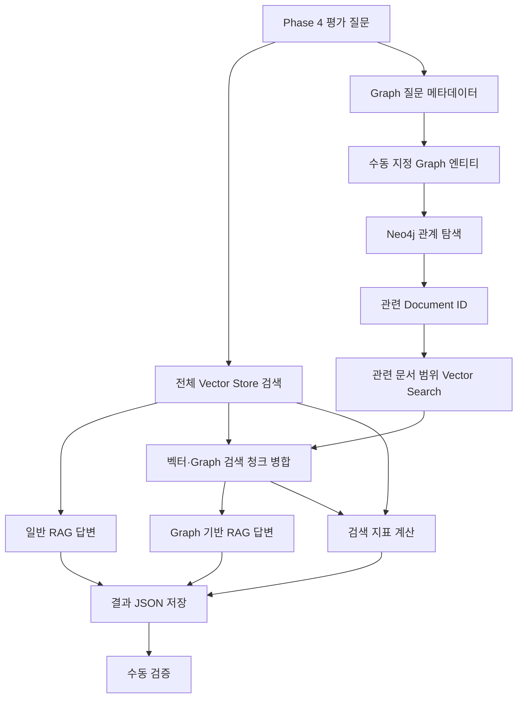

# Phase 6: GraphDB와 Graph 기반 RAG

> Phase 4 관계 질문을 대상으로 Neo4j 관계 탐색을 적용하고, Graph에서 조회한 관련 문서 ID를 기존 PostgreSQL pgvector 원문 청크 검색과 연결해 일반 RAG와 Graph 기반 RAG를 비교한다.

## 1. 범위

| 구분 | 내용 |
| --- | --- |
| 포함 | Neo4j Graph 모델 구성, Vertex·Edge 생성, 1-hop·2-hop Traversal, 관계 질문 분리, Graph 관련 문서 ID 조회, `file_name` 기반 Vector Store 검색, 벡터·Graph 검색 결과 병합, 일반 RAG와 Graph 기반 RAG 비교, Hit@5·Recall@5·Precision@5·MRR@5 계산, 생성 답변 수동 검토, 결과 JSON·실행 로그 저장 |
| 제외 | PDF 재처리, 청킹 변경, 저장 청크 변경, 임베딩 모델 변경, Chat Model 변경, System Prompt 변경, Phase 5 키워드·하이브리드·RRF·리랭킹, LLM 엔티티 자동 추출, 동적 Cypher, Microsoft GraphRAG, Neo4j Vector Search, APOC, GDS, Azure AI |
| 재사용 | Phase 4 평가 질문과 기대 청크, 기존 633개 Vector Store 청크, `RagService`, `EvaluationQuestionLoader`, `RetrievalMetricCalculator`, `RetrievedChunk`, `RetrievalMetrics`, `PgVectorStore` |
| 고정 조건 | 동일 문서, 동일 청크, 동일 임베딩 모델, 동일 Chat Model, 동일 System Prompt, Top-K 5, Similarity Threshold 0.7 |
| 변경 조건 | Neo4j 관계 탐색 추가, 관련 문서 ID 기반 Vector Store 검색 범위 제한 |
| 비교 방식 | 일반 RAG와 Graph 기반 RAG의 검색 결과, 검색 지표, 생성 답변 비교 |

GraphDB에는 관계 탐색에 필요한 Vertex·Edge와 문서 식별자만 저장했다.

원문 본문, 청크 ID, 임베딩은 Neo4j에 저장하지 않았다.

---

## 2. 처리 흐름



```text
Phase 4 평가 질문 읽기
→ q-001·q-002 관계 질문 분리
→ 일반 Vector Store 검색
→ 일반 RAG 답변
→ 수동 지정 엔티티로 Neo4j 관계 탐색
→ 관련 Document ID 조회
→ metadata.file_name 범위 Vector Store 검색
→ 기존 벡터 검색 결과와 병합
→ Graph 기반 RAG 답변
→ 검색 지표 계산
→ 자동 결과 JSON 저장
→ PostgreSQL·Neo4j·생성 답변 수동 검증
→ 수동 검토 JSON 분리 저장
```

---

## 3. 개발 환경

| 항목 | 값 |
| --- | --- |
| Java | 21 |
| Spring Boot | 4.1.0 |
| Spring AI | 2.0.0 |
| Gradle | 9.5.1 |
| DSL | Groovy |
| 실행 환경 | Windows PowerShell |
| 애플리케이션 | Non-Web CLI |
| 원본 PDF | `documents/source/graph-engineering-v2026.08.02.pdf` |
| Embedding 환경 | Ollama |
| Embedding Model | `qwen3-embedding:0.6b` |
| 임베딩 차원 | 1,024 |
| Chat Model | `qwen2.5-coder:7b` |
| Vector Store | `PgVectorStore` |
| PostgreSQL | 17 |
| 저장 청크 수 | 633 |
| GraphDB | Neo4j |
| Neo4j | 2026.06.0 |
| 연결 | Bolt `7687` |

실행 전 확인:

```powershell
docker compose ps
ollama list
Invoke-RestMethod http://localhost:11434/api/tags
```

Vector Store 청크 수:

```powershell
'SELECT COUNT(*) FROM public.vector_store;' |
docker compose exec -T pgvector `
  sh -c 'psql -U "$POSTGRES_USER" -d "$POSTGRES_DB" -tA'
```

#### 결과

| 확인 항목 | 결과 |
| --- | --- |
| pgvector | 실행 성공 |
| Neo4j | 실행 성공 |
| Ollama | 연결 성공 |
| `qwen3-embedding:0.6b` | 확인 |
| `qwen2.5-coder:7b` | 확인 |
| Vector Store 청크 | 633개 |
| Neo4j Bolt 연결 | 성공 |

기존 Vector Store를 변경하지 않고 사용했다.

문서 재처리, 재청킹, 재임베딩은 수행하지 않았다.

---

## 4. Neo4j 구성

### 4.1 Graph 데이터

실제 생성된 Vertex:

| Label | 수 |
| --- | ---: |
| `Document` | 1 |
| `Topic` | 2 |
| **합계** | **3** |

Topic:

```text
지식 노드
실행 노드
```

실제 Edge:

| Edge Type | 수 |
| --- | ---: |
| `HAS_TOPIC` | 2 |

관계:

```text
graph-engineering-v2026.08.02.pdf
→ HAS_TOPIC
→ 지식 노드

graph-engineering-v2026.08.02.pdf
→ HAS_TOPIC
→ 실행 노드
```

GraphDB 저장 범위:

```text
Vertex
Edge
엔티티명
Document.documentId
```

미저장:

```text
원문 본문
청크 ID
임베딩
```

관계를 확정하지 않은 추가 Label과 Edge는 생성하지 않았다.

### 4.2 Graph 파일

```text
graph/
├── schema.cypher
└── data.cypher
```

`schema.cypher`에서 Graph 제약 조건을 구성하고 `data.cypher`에서 원문으로 확인한 관계 데이터를 생성했다.

---

## 5. 구현 구조

```text
src/main/java/com/example/rag/
└── graph/
    ├── application/
    │   ├── GraphSearchService.java
    │   ├── GraphRagService.java
    │   ├── GraphDocumentMerger.java
    │   ├── RelatedDocumentSearch.java
    │   └── model/
    │       ├── GraphQuestion.java
    │       ├── GraphPathResult.java
    │       ├── GraphRetrievalResult.java
    │       ├── GraphRagCaseResult.java
    │       └── GraphRagComparison.java
    ├── config/
    │   └── GraphRagProperties.java
    ├── infrastructure/
    │   ├── PgVectorRelatedDocumentSearch.java
    │   ├── json/
    │   │   ├── GraphQuestionLoader.java
    │   │   └── GraphRagResultWriter.java
    │   └── neo4j/
    │       └── Neo4jGraphRepository.java
    └── presentation/
        └── cli/
            └── GraphRagRunner.java
```

| 구성요소 | 책임 |
| --- | --- |
| `GraphRagProperties` | Phase 6 실행 설정 |
| `GraphQuestionLoader` | Graph 질문 메타데이터 읽기와 검증 |
| `Neo4jGraphRepository` | 고정 Cypher 실행과 Graph 경로 조회 |
| `GraphSearchService` | 질문별 Graph 탐색 조정 |
| `RelatedDocumentSearch` | 관련 문서 범위 Vector Store 검색 추상화 |
| `PgVectorRelatedDocumentSearch` | `file_name` 메타데이터 필터 기반 검색 |
| `GraphDocumentMerger` | 일반·Graph 검색 청크 병합과 중복 제거 |
| `GraphRagService` | 일반 RAG와 Graph 기반 RAG 실행 |
| `GraphRagRunner` | 질문별 비교와 지표 계산 |
| `GraphRagResultWriter` | 자동 결과 JSON 저장 |

Phase 번호는 Java 패키지와 클래스명에 사용하지 않았다.

---

## 6. 평가 질문

### 6.1 기존 평가 질문

파일:

```text
evaluation/questions.json
```

| 질문 ID | 유형 | 질문 | 기대 청크 |
| --- | --- | --- | --- |
| `q-001` | `exact-term` | 지식과 실행을 한 그래프에 합친다는 것은 무엇인가? | `graph-engineering-v2026.08.02.pdf#461` |
| `q-002` | `semantic-paraphrase` | 에이전트 실행이 어떤 사실을 읽었는지 추적하려면 그래프를 어떻게 구성해야 하는가? | `graph-engineering-v2026.08.02.pdf#461` |
| `q-003` | `unanswerable` | Spring AI가 제공하는 양자 암호화 알고리즘은 무엇인가? | 없음 |

Phase 4에서 확정한 질문과 기대 청크를 변경하지 않았다.

### 6.2 Graph 질문

파일:

```text
evaluation/graph-questions.json
```

Phase 6 관계 질문:

```text
q-001
q-002
```

Graph 질문 설정:

```text
queryType
→ DOCUMENTS_BY_TOPICS

entityNames
→ 지식 노드
→ 실행 노드
```

`q-003`은 Graph 질문 메타데이터에 포함하지 않았다.

LLM을 이용한 엔티티 추출과 동적 Cypher 생성은 사용하지 않았다.

---

## 7. Graph 탐색

### 7.1 1-hop

Neo4j 직접 조회 결과:

| 시작 Vertex | Edge | 도착 Vertex |
| --- | --- | --- |
| `graph-engineering-v2026.08.02.pdf` | `HAS_TOPIC` | `실행 노드` |
| `graph-engineering-v2026.08.02.pdf` | `HAS_TOPIC` | `지식 노드` |

두 `Document → Topic` 관계를 실제 Neo4j 조회로 확인했다.

### 7.2 2-hop

실제 경로:

```text
지식 노드
← HAS_TOPIC -
Document
- HAS_TOPIC →
실행 노드
```

직접 Cypher 결과:

```text
firstEntity
→ 지식 노드

documentId
→ graph-engineering-v2026.08.02.pdf

secondEntity
→ 실행 노드

relationships
→ [HAS_TOPIC, HAS_TOPIC]

hopCount
→ 2
```

애플리케이션 Graph 탐색 결과와 직접 Cypher 결과가 일치했다.

3-hop 이상 탐색은 수행하지 않았다.

---

## 8. Graph와 Vector Store 연결

GraphDB 문서 식별자:

```text
Document.documentId
→ graph-engineering-v2026.08.02.pdf
```

Vector Store 문서 식별자:

```text
metadata.file_name
→ graph-engineering-v2026.08.02.pdf
```

직접 조회 결과 두 값이 일치했다.

```text
Document.documentId
=
metadata.file_name
```

Graph 관련 문서 ID를 `metadata.file_name` 필터로 변환해 기존 `VectorStore`에서 검색했다.

```text
GraphDB
→ 관련 documentId

PgVectorRelatedDocumentSearch
→ file_name IN documentIds
→ 동일 Vector Store
→ 동일 Embedding Model
→ Top-K 5
→ Similarity Threshold 0.7
```

별도 SQL 검색이나 Phase 5 검색 방식은 사용하지 않았다.

---

## 9. 검색 결과 병합

병합 기준:

```text
<file_name>#<chunk_index>
```

처리:

```text
기존 벡터 검색 결과
→ 먼저 유지

Graph 관련 문서 검색 결과
→ 중복 청크 제거
→ 신규 청크만 추가

최종 결과
→ 최대 5개
```

자동 테스트에서는 아래 조건으로 병합을 검증했다.

```text
기존 벡터:
document.pdf#10
document.pdf#20

Graph:
document.pdf#20
document.pdf#30

결과:
document.pdf#10
document.pdf#20
document.pdf#30
```

기존 벡터 검색 순서 유지, 중복 제거, Graph 신규 청크 추가, 최종 Top-K 제한을 확인했다.

실제 `q-001`, `q-002` 실행에서는 Graph 관련 문서 검색 결과가 0건이라 신규 청크 추가는 발생하지 않았다.

---

## 10. 검색 품질 비교

### 10.1 일반 RAG

| 질문 | 검색 결과 | 기대 청크 | Hit@5 | Recall@5 | Precision@5 | RR |
| --- | ---: | --- | ---: | ---: | ---: | ---: |
| `q-001` | 0건 | 미검색 | 0 | 0.0 | 0.0 | 0.0 |
| `q-002` | 0건 | 미검색 | 0 | 0.0 | 0.0 | 0.0 |

MRR@5:

```text
(0.0 + 0.0) / 2
= 0.0
```

### 10.2 Graph 기반 RAG

Graph 탐색:

```text
지식 노드
→ 2-hop
→ 실행 노드

관계
→ HAS_TOPIC → HAS_TOPIC

관련 문서
→ graph-engineering-v2026.08.02.pdf
```

검색 결과:

| 질문 | 관련 문서 검색 | 병합 결과 | 기대 청크 | Hit@5 | Recall@5 | Precision@5 | RR |
| --- | ---: | ---: | --- | ---: | ---: | ---: | ---: |
| `q-001` | 0건 | 0건 | 미검색 | 0 | 0.0 | 0.0 | 0.0 |
| `q-002` | 0건 | 0건 | 미검색 | 0 | 0.0 | 0.0 | 0.0 |

MRR@5:

```text
(0.0 + 0.0) / 2
= 0.0
```

상태:

```text
q-001
→ GRAPH_DOCUMENT_SEARCH_EMPTY

q-002
→ GRAPH_DOCUMENT_SEARCH_EMPTY
```

### 10.3 방식 비교

| 항목 | 일반 RAG | Graph 기반 RAG |
| --- | --- | --- |
| 검색 범위 | 전체 Vector Store | Graph 관련 문서 |
| 실제 문서 집합 | 문서 1개 | 동일 문서 1개 |
| q-001 기대 청크 | 미검색 | 미검색 |
| q-002 기대 청크 | 미검색 | 미검색 |
| Hit@5 | `0.0000` | `0.0000` |
| Recall@5 | `0.0000` | `0.0000` |
| Precision@5 | `0.0000` | `0.0000` |
| MRR@5 | `0.0000` | `0.0000` |
| Retrieval 개선 | 없음 | 없음 |

Graph 관계 탐색은 관련 문서를 정상적으로 찾았지만 기대 청크 검색 결과는 개선되지 않았다.

---

## 11. 기대 청크와 실패 확인

기대 청크:

```text
graph-engineering-v2026.08.02.pdf#461
```

PostgreSQL에서 `#460`~`#462`를 직접 조회했다.

`#461`에서 확인한 내용:

```text
지식 노드와 실행 노드를 같은 그래프에 두고
둘 사이에 엣지를 긋는 구조
```

```text
이 실행이 저 사실을 읽었다는 관계
```

인접 `#462`에서는 `Run`, `Entity`, `Reads` 관계의 구체적인 Graph 구조를 확인했다.

확인 결과:

| 항목 | 결과 |
| --- | --- |
| 기대 청크 Vector Store 존재 | 확인 |
| 기대 청크 원문 근거 | 확인 |
| Graph 경로 | 확인 |
| Graph 관련 문서 ID | 확인 |
| 문서 식별자 연결 | 정상 |
| 일반 Vector Search | 0건 |
| 관련 문서 범위 Search | 0건 |
| 병합 결과 | 0건 |
| 기대 청크 검색 | 실패 |

근본적인 기대 청크 미검색 원인은 이번 실행 결과만으로 확정하지 않았다.

```text
근본 원인
→ 확인 불가
```

검색 결과를 만들기 위해 Similarity Threshold, 질문, 청크, Embedding Model을 변경하지 않았다.

---

## 12. 생성 답변 검토

### q-001

일반 RAG:

```text
알 수 없다.
```

Graph 기반 RAG:

```text
알 수 없습니다. 제공된 정보에는 "지식과 실행을 한 그래프에 합친"이라는 개념에 대한 명확한 정의나 설명이 포함되어 있지 않습니다.
```

### q-002

일반 RAG:

```text
알 수 없다. 제공된 정보에는 에이전트 실행을 추적하기 위한 특정한 그래프 구성을 언급하지 않습니다.
```

Graph 기반 RAG:

```text
알 수 없다. 제시된 정보에는 에이전트의 실행 로그나 그 로그를 분석하기 위한 특정한 그래프 구성 방법에 대한 자세한 내용이 포함되어 있지 않습니다.
```

두 질문 모두 생성 Context에 기대 청크 `#461`이 포함되지 않았다.

```text
expectedChunkExistsInStore
→ true

expectedChunkRetrieved
→ false
```

기대 청크가 Context에 없으므로 Generation 실패로 분류하지 않았다.

수동 판정:

| 질문 | Retrieval 실패 | Generation 실패 | 분류 |
| --- | --- | --- | --- |
| `q-001` | 해당 | 해당 없음 | `GRAPH_RETRIEVAL_FAILURE` |
| `q-002` | 해당 | 해당 없음 | `GRAPH_RETRIEVAL_FAILURE` |

---

## 13. 단일 문서 조건

Vector Store 고유 문서 수:

```text
1
```

Vector Store 문서:

```text
graph-engineering-v2026.08.02.pdf
```

Graph 관련 문서:

```text
graph-engineering-v2026.08.02.pdf
```

비교:

```text
전체 Vector Store 문서 집합
=
Graph 관련 문서 집합
```

현재 단일 문서 환경에서는 Graph 문서 필터를 적용해도 실제 검색 대상 문서 범위가 줄어들지 않았다.

이 결과는 Graph 구현 오류로 분류하지 않았다.

---

## 14. 결과 저장

### 14.1 자동 결과

```text
evaluation/results/phase6-graph-rag-results.json
```

저장 항목:

```text
실행 설정
질문 정보
기대 문서·청크
Graph 엔티티
Graph 탐색 유형
Graph 관계
Graph Hop 수
관련 문서 ID
일반 검색 결과
관련 문서 범위 검색 결과
병합 검색 결과
검색 지표
일반 RAG 답변
Graph 기반 RAG 답변
실행 상태
```

### 14.2 수동 검토 결과

```text
evaluation/results/phase6-graph-rag-results-reviewed.json
```

수동 검토 필드:

```text
graphPathValid
relatedDocumentIdValid
expectedChunkExistsInStore
expectedChunkRetrieved
retrievalFailure
generationFailure
singleDocumentFilterNoEffect
classification
reason
```

자동 결과 파일은 수정하지 않았다.

---

## 15. 자동 테스트

### 15.1 실행

```powershell
.\gradlew.bat clean test --console=plain
```

#### 결과

```text
BUILD SUCCESSFUL in 1m 9s
```

| 항목 | 결과 |
| --- | ---: |
| 전체 테스트 | 28개 |
| 성공 | 28개 |
| 실패 | 0개 |
| 건너뜀 | 0개 |
| 성공률 | 100% |
| 테스트 실행 시간 | 54.157초 |
| Gradle 전체 실행 시간 | 1분 9초 |

### 15.2 Phase 6 테스트

| 테스트 클래스 | 테스트 수 | 실패 | 실행 시간 |
| --- | ---: | ---: | ---: |
| `GraphQuestionLoaderTest` | 7 | 0 | 0.332초 |
| `GraphSearchServiceTest` | 2 | 0 | 0.089초 |
| `GraphDocumentMergerTest` | 2 | 0 | 0.015초 |
| `PgVectorRelatedDocumentSearchTest` | 2 | 0 | 0.011초 |
| `GraphRagServiceTest` | 3 | 0 | 0.136초 |
| **합계** | **16** | **0** | **0.583초** |

검증 범위:

- Graph 질문 JSON 검증
- q-001·q-002 연결
- q-003 제외
- Graph 탐색 호출
- 관련 문서 ID 전달
- `file_name` 필터 생성
- Top-K `5` 전달
- Similarity Threshold `0.7` 전달
- 기존 벡터 순서 유지
- 청크 중복 제거
- 신규 Graph 청크 추가 로직
- 일반 RAG와 Graph 기반 RAG 실행
- Graph 경로 없음 처리
- Graph 문서 검색 결과 없음 처리

실제 Neo4j·PostgreSQL·Ollama 연결은 CLI 실행으로 검증했다.

---

## 16. 실행 검증

### 16.1 실행

```powershell
$env:SPRING_APPLICATION_JSON = @'
{
  "rag": {
    "document": {
      "enabled": false
    },
    "retrieval": {
      "enabled": false
    },
    "generation": {
      "enabled": false
    },
    "evaluation": {
      "enabled": false
    },
    "improvement": {
      "enabled": false
    },
    "graph": {
      "enabled": true,
      "questions-path": "evaluation/questions.json",
      "graph-questions-path": "evaluation/graph-questions.json",
      "results-path": "evaluation/results/phase6-graph-rag-results.json",
      "top-k": 5,
      "similarity-threshold": 0.7
    }
  }
}
'@

.\gradlew.bat bootRun --console=plain 2>&1 |
  Tee-Object `
    -FilePath .\build\phase6-graph-rag-output.txt

Remove-Item Env:SPRING_APPLICATION_JSON
```

### 16.2 실행 결과

| 항목 | 결과 |
| --- | --- |
| 관계 질문 | `q-001`, `q-002` |
| Top-K | 5 |
| Similarity Threshold | 0.7 |
| Graph 탐색 | 성공 |
| Graph Hop | 2 |
| 관련 문서 ID 조회 | 성공 |
| 일반 검색 | 두 질문 모두 0건 |
| 관련 문서 범위 검색 | 두 질문 모두 0건 |
| 병합 결과 | 두 질문 모두 0건 |
| Graph RAG 상태 | `GRAPH_DOCUMENT_SEARCH_EMPTY` |
| Hit@5 | `0.0000` |
| Recall@5 | `0.0000` |
| Precision@5 | `0.0000` |
| MRR@5 | `0.0000` |
| 결과 JSON | 생성 성공 |
| 실행 로그 | 생성 성공 |
| 빌드 | `BUILD SUCCESSFUL` |
| Gradle 실행 시간 | 35초 |

Spring Boot 시작 시간:

```text
6.737초
```

---

## 17. 문제와 한계

| 문제·한계 | 확인된 내용 | 처리 |
| --- | --- | --- |
| 일반 Vector Search 결과 없음 | q-001·q-002 모두 0건 | 기존 조건 유지 |
| Graph 문서 검색 결과 없음 | 관련 문서 ID는 조회됐지만 검색 결과 0건 | 실제 결과 보존 |
| 기대 청크 미검색 | `#461`은 Store에 존재하지만 검색되지 않음 | Retrieval 실패 기록 |
| Graph 필터 효과 없음 | 전체 문서와 Graph 관련 문서가 같은 단일 문서 | 구현 오류로 분류하지 않음 |
| Graph 신규 청크 추가 없음 | 실제 Graph 검색 결과가 0건 | 자동 테스트에서 로직만 검증 |
| Generation 평가 제한 | 기대 청크가 Context에 없음 | Generation 실패 판정 제외 |
| 근본 검색 실패 원인 | 현재 실행으로 확정 불가 | `확인 불가` 기록 |

Graph 경로 자체는 정상적으로 조회됐다.

```text
지식 노드
← HAS_TOPIC -
Document
- HAS_TOPIC →
실행 노드
```

Graph 탐색 성공과 Retrieval 성공이 동일하지 않음을 실제 실행으로 확인했다.

---

## 18. 결과 파일

```text
graph/schema.cypher
graph/data.cypher
evaluation/questions.json
evaluation/graph-questions.json
evaluation/results/phase6-graph-rag-results.json
evaluation/results/phase6-graph-rag-results-reviewed.json
build/phase6-graph-rag-output.txt
```

| 파일 | 내용 |
| --- | --- |
| `graph/schema.cypher` | Neo4j Graph 스키마 |
| `graph/data.cypher` | 원문 기반 Graph 데이터 |
| `evaluation/questions.json` | Phase 4부터 유지한 평가 질문 |
| `evaluation/graph-questions.json` | Phase 6 관계 질문과 엔티티 |
| `phase6-graph-rag-results.json` | 자동 실행 결과 |
| `phase6-graph-rag-results-reviewed.json` | 수동 검토 결과 |
| `phase6-graph-rag-output.txt` | 실제 Graph RAG 실행 로그 |

---

## 19. 완료 기준

* [x] Neo4j 이미지와 실제 버전 확인
* [x] Neo4j 컨테이너와 Bolt 연결 확인
* [x] Spring Data Neo4j 구성
* [x] `graph/schema.cypher` 작성과 적용
* [x] 기대 청크 `#461` 원문 재확인
* [x] 인접 청크 `#460`~`#462` 확인
* [x] 원문 기반 Graph 엔티티와 관계 확정
* [x] `graph/data.cypher` 작성과 적용
* [x] Neo4j 원문·청크 ID·임베딩 미저장 확인
* [x] 1-hop 관계 직접 검증
* [x] 2-hop Traversal 직접 검증
* [x] 관련 문서 ID 조회
* [x] `q-001`, `q-002` 관계 질문 연결
* [x] `q-003` 제외
* [x] 수동 엔티티와 고정 탐색 유형 적용
* [x] Graph 질문 로더 구현
* [x] Neo4j Repository 구현
* [x] Graph 검색 서비스 구현
* [x] 관련 문서 범위 Vector Store 검색 구현
* [x] `Document.documentId`와 `metadata.file_name` 일치 확인
* [x] 벡터·Graph 검색 결과 병합 구현
* [x] 기존 벡터 검색 순서 유지
* [x] 중복 청크 제거
* [x] Graph 신규 청크 추가 로직 검증
* [x] 최종 Top-K 5 제한
* [x] 기존 `RagService` 재사용
* [x] 일반 RAG 실행
* [x] Graph 기반 RAG 실행
* [x] Hit@5·Recall@5·Precision@5·MRR@5 비교
* [x] 생성 답변 수동 검토
* [x] Retrieval 실패와 Generation 실패 분리
* [x] 단일 문서 필터 효과 확인
* [x] 전체 자동 테스트 28개 성공
* [x] 실제 Neo4j·PostgreSQL·Ollama 연동 성공
* [x] 자동 결과 JSON 저장
* [x] 수동 검토 결과 분리 저장
* [x] 실행 로그 저장
* [x] 실패 결과와 확인된 범위 기록
* [x] Phase 5 검색 방식 미사용
* [x] Microsoft GraphRAG 미포함
* [x] Phase 7 기능 미포함
* [x] 확인된 실제 결과만 문서에 기록

근본적인 기대 청크 미검색 원인은 현재 실행 결과만으로 확정하지 않았다.

---

## Phase 6 결과

| 항목 | 결과 |
| --- | --- |
| 평가 관계 질문 | 2개 |
| 실행 질문 | `q-001`, `q-002` |
| 재사용 청크 | 633개 |
| GraphDB | Neo4j `2026.06.0` |
| Vertex | `Document` 1개, `Topic` 2개 |
| Edge | `HAS_TOPIC` 2개 |
| 탐색 | 1-hop·2-hop |
| Graph 경로 | `HAS_TOPIC → HAS_TOPIC` |
| 관련 문서 | `graph-engineering-v2026.08.02.pdf` |
| Top-K | 5 |
| Similarity Threshold | 0.7 |
| 일반 RAG 검색 | 두 질문 모두 0건 |
| Graph 문서 범위 검색 | 두 질문 모두 0건 |
| 병합 검색 | 두 질문 모두 0건 |
| Hit@5 | `0.0000` |
| Recall@5 | `0.0000` |
| Precision@5 | `0.0000` |
| MRR@5 | `0.0000` |
| Graph 경로 조회 | 성공 |
| 기대 청크 `#461` | Vector Store 존재 확인 |
| 기대 청크 검색 | 실패 |
| Retrieval 개선 | 없음 |
| Retrieval 실패 | `q-001`, `q-002` |
| Generation 실패 | 해당 없음 |
| 단일 문서 필터 효과 | 없음 |
| 근본 미검색 원인 | 확인 불가 |
| 전체 테스트 | 28개 성공, 실패 0개 |
| 실행 결과 | `BUILD SUCCESSFUL` |
| 자동 결과 | `evaluation/results/phase6-graph-rag-results.json` |
| 수동 검토 결과 | `evaluation/results/phase6-graph-rag-results-reviewed.json` |
| 실행 로그 | `build/phase6-graph-rag-output.txt` |

Phase 6에서는 Neo4j 관계 탐색으로 질문과 연관된 문서를 정상적으로 조회하고 기존 Vector Store 원문 청크 검색까지 연결했다.

두 관계 질문 모두 2-hop Graph 경로와 관련 문서 ID 조회에는 성공했다.

현재 Vector Store가 단일 문서로 구성되어 있어 Graph 문서 필터가 검색 범위를 줄이지 못했고, 일반 RAG와 Graph 기반 RAG 모두 기대 청크 `#461`을 검색하지 못했다.

Graph 적용에 따른 Retrieval 품질 개선은 확인되지 않았다.

Graph 탐색 성공과 Vector Retrieval 성공은 별개의 단계이며, 최종 답변 근거는 GraphDB가 아닌 기존 Vector Store 원문 청크에서 확인해야 함을 실제 실행으로 검증했다.